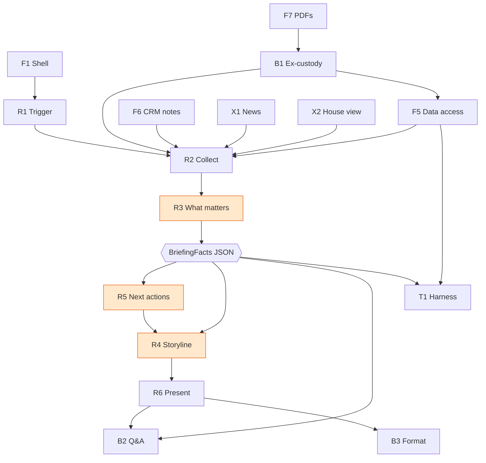

# UNRISKOMEGA — Working Notes

Reference notes for the START Global × Swiss AI Weeks 2026 hackathon challenge.
Everything marked **verified** was checked directly against the files in `unriskomega-2026/`.
Append to this file as the project progresses; don't duplicate it elsewhere.

---

## 1. The challenge

A wealth advisor gets a short-notice client call. To prepare, they must review performance,
allocation, suitability, investment rules, open proposals, client notes, market developments and the
bank's investment view — across several systems. The task: build a prototype where the advisor clicks
**Generate Briefing** and receives a client-specific briefing readable in ~60 seconds.

The briefing must answer four questions:

1. **What happened?** — recent portfolio development and its main drivers
2. **What is the current situation?** — allocation deviations, risks, suitability issues, rule violations
3. **What could happen next?** — connect the portfolio to market developments and the bank's view
4. **What should the advisor do?** — concrete next best actions

Delivered as three sections: *Recent Portfolio Development*, *Portfolio Health Check*,
*Portfolio Outlook & Next Best Actions*.

**Explicit constraint:** the prototype must NOT run inside the live URO environment. It is presented in
a **mocked URO Advisor Pro interface** built from the supplied screenshots and brand assets.

---

## 2. The four inputs — what exists and what doesn't

| Needed for the briefing | In the folder? | Where / how |
|---|---|---|
| Client + portfolio + position data | ✅ | `clients.json`, `reference.json` |
| Notes about the client ("CRM context") | ✅ | `ClientNotes[]`, `Tags[]` — thin, no real CRM |
| Market news | ❌ | Must be fetched (brief suggests Yahoo Finance) |
| Bank house view / CIO view | ❌ | Must be mocked from public CIO publications |

Both gaps are **intentional** — `task_def.txt` lines 158–173 are an entire section titled
*"External Information Sources"*:

> *"The assistant should enrich the provided portfolio and client data with external information."* (160)
> *"Teams should identify a practical method for retrieving relevant market news."* (164) — a real mechanism
> *"Teams should also incorporate a sample strategic or tactical investment view from a bank…
> may be used as **mock inputs**."* (170) — a curated mock is expected

Both must be **linked to the client's actual holdings** (172). A generic market summary earns nothing.
The final presentation must state **which elements use mock data** — declaring the house view as mock is
the intended answer, not an admission.

**Third gap:** line 143 lists *"Open client-specific tasks"* as available data, but no such field exists
in the delivered files. Hedged with *"may include"* (131). Derive from violations, draft proposals and notes.

---

## 3. Data inventory (verified)

### `core-case/portfolio-data/clients.json` — 3.44 MB

| Item | Count |
|---|---|
| Clients | 47 |
| Portfolios | 57 |
| Security positions | 703 |
| Account positions | 123 |
| Performance points | 3,306 (2021-10 → 2026-07, monthly) |
| Proposals | 206 (`Final` 125 / `Abgelehnt` 76 / `Entwurf` 5) |
| Transactions | 1,274 |
| Suitability violations | 180 — **96 `Error` / 84 `Warning`**, spanning 19 / 20 clients (50 distinct rules) |
| Individual rule overrides | 3 |
| Client notes | 153 (only **53 distinct** texts — they repeat) |
| Tag assignments | 73 |

### `core-case/portfolio-data/reference.json` — 14.61 MB, 12 collections

| Collection | Rows |
|---|---|
| `FundUnbundlingMappings` | 48,101 |
| `Securities` | 504 |
| `SuitabilityRules` | 54 |
| `Tags` | 19 (8 regions + 11 industries) |
| `StrategicAssetAllocations` | 16 |
| `InvestmentServices` / `Strategies` | 7 / 6 |
| `RiskProfiles` | 5 (Ids 15–19; `MaxVola` 0.075 / 0.1 / 0.12 / 0.15 / 0.185) |
| `ProposalStatuses` / `AdvisoryTypes` | 3 / 2 |
| `RecommendationLists` / `EsgProfiles` | 1 / 2 |

### Clients are fictional; the instruments are real

494 of 504 securities carry well-formed ISINs and real names — VZ Holding AG (`CH0528751586`),
Lindt & Sprüngli (`CH0010570759`), Holcim, Sika, SIG Group, Neste. Only the *people* are invented
(Yoda, Joker, Ron Burgundy, Rocky Balboa…). **This means live news can be pulled for real
instruments.** It is the single strongest asset for a credible demo.

Exceptions: a few unlisted/fictional instruments, e.g. `SpaceX Aktie` (`US84615Q1031`, no real price).

---

## 4. Doc-vs-data contradictions (verified — trust the data, not the docs)

| Claim in `README.md` / `DATA.md` | Reality |
|---|---|
| "Absent, not null" — missing values are absent, not `null` | **Both occur.** `Company` `null` ×43, `IndividualRuleOverrides` ×44, `SuitabilityViolations` ×20, `EsgProfileId`/`Name` ×19, `Transactions` ×18, `Proposals` ×17, `Birthday` ×4 — *and* `SecurityPositions` **absent** (not null) on 8 portfolios |
| `Tags` = "17 entries: 6 regions + 11 industries" | **19 entries: 8 regions + 11 industries** |
| `PerformanceYTD` is a portfolio field (live risk-engine output) | **`null` on all 57 portfolios.** Compute from `PerformanceHistory` |
| Proposal status example `"Finalized"` | Values are German: `Final`, `Abgelehnt`, `Entwurf` |
| Notes are "English only" (intro) / "German or French" (field table) | **English**, and heavily duplicated (53 distinct across 153) |
| Every SAA has asset-class targets | **All 16 SAAs carry 5 `AssetClass` rows, but SAA 96 (`Consolidaton Investmentservice / CHF / no strategy`) has no `Min`/`Target`/`Max` on any of them** — that is the one genuine "Keine Strategie" case; comparison must degrade gracefully |
| — | Data typo: `'Specialties andCommodities'` (missing space) — exact-string matching landmine |

Also `null` on: `Portfolios[].Volatility` ×7, `ExpectedReturn`/`ValueAtRisk` ×6, `FactoryDateUtc` ×2.

**Consequence:** handle **both** absent keys and explicit nulls. `c.get(k, [])` silently yields `None`,
and `len(None)` crashes — this bit us in the very first analysis pass.

---

## 5. Data landmines

1. **Violations cannot be recomputed — only displayed.** Re-deriving "Compliance with maximum
   volatility" from `RiskProfile.MaxVola` vs `Portfolio.Volatility` disagrees with the ground truth on
   **15 of 46** portfolios. `CASE-001-01` has `Volatility: 0.0` yet is flagged with a max-volatility
   **Error**; `CASE-011-01` carries `0.60582` (60%) against a 0.15 ceiling and is **not** flagged. The
   same portfolio is flagged for both "risk too high" (sim `0.11857 > 0.115`) and "risk too low"
   (`0.0 < 0.085`). Use `ViolationPath[]` as the authoritative explanation — it holds the engine's own
   simulated `LeftValue`/`RightValue`. Operator codes are undocumented; `30` = less-than and `40` =
   greater-than are established from behaviour, `50`/`60` unresolved.
2. **`CASE-008` is deliberately dirty.** All **12** of its violations and its 1 proposal point at portfolio IDs
   `210121`, `210525`, `141384` — which exist on **no client at all** (13 dangling refs). **`CASE-038` is dirty
   too**: 15 of its 18 violations reference non-existent portfolio ids, for **28 dangling refs across the two
   clients** in total. Verified during the build (`integrity_report()`).
3. **`CASE-029`–`CASE-032` have no risk profile** (`RiskProfileId` and `RiskProfileName` both null).
4. **Non-ISO account currencies**: `BTC` ×2, `ETH` ×2, `SOL` ×2, `SHIB`, and `OZG`
   (`Metallkonto OZG`, CASE-022 — a precious-metal account reusing the cash shape).
5. **`AccountPositions[].IBAN` values are real and passed through as-is.** Never render, log or publish.
6. **Recency lag:** last performance point is **2026-07-01**, newest `FactoryDateUtc` **2026-09-03**,
   today **2026-09-18** — roughly an 11-week gap. "Recent development" must be defined over monthly points.
7. **No dramatic drawdown exists in the data.** Largest 3-month moves across 57 portfolios: worst
   **−2.37%** (CASE-014), best **+13.87%** (CASE-011). The brief's example scenario ("portfolio has
   fallen") is not pre-made — it must come from the news layer.
8. **Proposal field names are not the obvious ones.** A proposal carries `ProposalStatusName`
   (`Final` / `Abgelehnt` / `Entwurf`), `ProposalId`, `AdvisoryTypeName`, `Reason`, `ProposedDateUTC` —
   **not** `Status`, `Id`, `Title` or `CreatedByDateUTC`. An R3 extractor reading the guessed names still
   compiled and ran, and produced **zero** findings for the 5 clients holding a draft (`CASE-017`,
   `CASE-034`, `CASE-037`, `CASE-042`, `CASE-045`). Found and fixed 2026-09-18 (`_open_proposal`, also
   moved from the per-portfolio loop to the client level so it cannot duplicate); now guarded by
   `test_every_type_fires_and_every_draft_surfaces`. `ProposedDateUTC` is absent on 3 of the 5 drafts —
   those render as `Entwurf vom unbekannt`, never a substituted date.
9. **A `Transactions` row has no date and no transaction type.** Its keys are exactly
   `TransactionId`, `PublicGuid`, `ProposalId`, `SecurityId`, `Isin`, `SecurityName`,
   `QuantityForTransaction`, `Currency`, `TotalAmount`, `IsExpiry` (true on 2 rows) (and `ForwardState` on
   660 of 1,274 rows). Signs carry the direction: `QuantityForTransaction` and `TotalAmount` are
   negative for a sale (279 rows) and positive for a purchase (991), with 4 zeros. **Every row resolves
   to a proposal on the same client** (1,274 / 1,274), which is the only way to date a trade — but 398
   rows hang off an `Abgelehnt` proposal and 26 off an `Entwurf`, so a trade is only counted as executed
   when its proposal is `Final` (850 rows). Amounts are in the transaction's own currency: 1,274 rows
   span several currencies, so summing them would invent an FX rate. Both facts are declared in the
   finding's evidence rather than assumed.

### Checks that came back clean

- Every documented join resolves **except** the CASE-008 orphans and the 4 null risk profiles.
- Position weights plus cash accounts sum to 1.0 in 52 of 57 portfolios within 1e-6; the largest
  deviation is `CASE-023-01` at 1.95e-3 (0.195%). `SecurityPositions` alone never sum to 1 — the
  remainder is `AccountPositions`, which is expected. (An earlier note claimed 1.0 in all 57; that was
  measured without the tolerance and without the cash accounts.)
- Every held `SAA_AssetClassName` matches a target row, when that SAA has `AssetClass` rows.
- Join on **`SecurityId`, not `Isin`** — an ISIN can appear as multiple currency share classes.
- `FundUnbundlingMappings[].Weight` is **0–100**; SAA targets and position percentages are **0–1**.
  Verified: per-fund sums are ≈100.0017, and **484 rows are negative** — look-through must tolerate negatives
  and never clamp them.

### Checks that are NOT clean — measured 2026-09-19

- **`sum(ContributionVolatility)` does not reconcile to `Portfolio.Volatility` in general.** It holds
  within 1e-6 for 14 of 57 portfolios and within 1e-3 for 53 of 57. Two distinct causes:
  - `CASE-041-01` sums to **574'339.38** against a volatility of **0.098**, because one position
    (`XS1412417617`, a National Australia Bank bond) carries `MarginalContributionToRisk`
    **9'223'372.03685** — an int64-overflow sentinel (`9223372036.854775807 × 1000`) — and therefore
    `ContributionVolatility` **574'339.3767346495**. The identity `contribution = marginal × weight`
    holds for that row, so the corruption is upstream in the export. Guarded by
    `metrics.risk_contributions()` + `tests/test_risk_guard.py`.
  - `CASE-023-01`, `CASE-027-01` and `CASE-045-01` carry a `Volatility` (0.245 / 0.12187 / 0.11297)
    while **every** `MarginalContributionToRisk` and `ContributionVolatility` is `0` — the series is
    simply not populated. Declared as unavailable, never rendered as a zero-risk portfolio.
- **The identity `ContributionVolatility == MarginalContributionToRisk × PortfolioValuePercentage` is
  approximate**: it fails on 87 of 703 positions (rounding in the export), so it is not a usable
  validation rule.
- **`SuitabilityRules` has a duplicate `RuleCode`** (54 rows, 53 distinct codes) — see §5 landmine 14
  in `PROJECT.md`.

---

## 6. Demo scenarios — real clients, real stories

| Story | Clients | The facts |
|---|---|---|
| **Concentration** | CASE-028 Charles Foster Kane, CASE-014 Katniss Everdeen, CASE-009 Dorothy Gale, CASE-021 Holden Caulfield | **~95% in one stock** — VZ Holding AG (`CH0528751586`). One real headline moves 95% of the wealth |
| **No data available** | CASE-027 Buzz Lightyear | **68.5% in `SpaceX Aktie`** — a private instrument whose price field is populated in the data (`149.78`, so the "missing price" story is wrong) but whose ISIN `US84615Q1031` no live news source covers. The gap to declare is real market/news coverage, not a missing price. Tests graceful refusal |
| **Preference conflict** | CASE-017 | Note *"avoid fossil fuels"* vs holding **Neste Corporation (Energy)**. The rule engine flags **nothing** — pure AI value-add |
| **Life event vs advice** | CASE-007 Mary Poppins | *"Planning to buy a property, possible liquidity need within 12 months"* → illiquid suggestions are wrong |
| **Rule breach to resolve** | CASE-007 | Max volatility **0.1264 vs 0.12 ceiling** |
| **Allocation drift** | CASE-007 | **56.7% shares vs 75% agreed** |
| **Currency risk** | CASE-012 | **82.2% USD** against a "foreign currency exceeds 50%" flag |
| **Crypto** | CASE-001 Yoda, CASE-023 | BTC / ETH via account positions; one client tolerates high concentration "including digital assets" |
| **Broken data** | CASE-008 | Violations point at non-existent portfolios — must not crash or invent |

**Caveat on preference conflicts:** only **CASE-017 (Neste, a direct stock)** is solidly evidenced.
ETF name matches are unconfirmed and require `FundUnbundlingMappings` look-through. Never claim a
conflict without look-through — stating that rule out loud is itself a credibility win.

---

## 7. Proving it works "to real-life standards"

Real-life standard = **trust**, not polish. Six tests:

1. **Traceability** — every sentence links to its source field; a juror can click any claim and see the
   underlying data. This is the main differentiator from "we called an LLM".
2. **Graceful refusal** — with Buzz Lightyear (no price) or a client with no risk profile, say
   *"unavailable"*; never invent. Judges actively hunt for hallucination.
3. **Hand-checkable numbers** — recompute three figures live (the ~15% return, the 95.9% weight, the
   0.1264 vs 0.12 breach) in front of the jury.
4. **Generalization** — the brief warns an **unseen test client** may arrive before the final. Rehearse:
   drop in a new file → click Generate → useful briefing. Same for an ex-custody PDF import.
5. **Advisor realism** — have the most finance-literate teammate role-play the client for 2 minutes.
   Cut any sentence a real advisor would wince at.
6. **Visible news linkage** — show the chain: *you hold 95.9% VZ Holding → this headline is about VZ
   Holding → therefore your portfolio.* The chain is the feature.

Also worth timing: the manual process takes 20–30 minutes across systems; the tool targets 60 seconds.
Demonstrate the contrast.

---

## 8. Supporting material

### Screenshots — `core-case/GUI-screenshots/`

| File | Resolution | Shows |
|---|---|---|
| `Client_Advisor_DB.png` | 3422×963 | Advisor dashboard: 107 clients, filter tabs `01 - Liquidity > 10%`, `02 - Maturities`, `03 - Last Consultation > 12 Months`, `04 - Rule Violations (urgent)`, `05 - Birthdays` |
| `Client_DB.png` | 3413×1234 | One client: portfolio cards + `Beratungen` table with `Vorgeschlagen` / `Entwurf` statuses |
| `Portfolio_DB.png` | 3413×1273 | Portfolio `Analyse` tab: target-vs-actual table (`Min.`/`Soll`/`Max.`/`Portfolio`/`Aktion`), 15-metric sidebar, `Positionsliste`, `Fondssplitting deaktivieren` button |

The UI is German. Useful vocabulary: `Beratungen`, `Anlagevorschlag`, `Depotbesprechung`,
`Telefonberatung`, `Vorgeschlagen`, `Entwurf`, `Fremdbanken`, `Konsolidierung`, `Beziehungen`,
`Kundenberater-Dashboard`, `Positionsliste`, `Fondssplitting`.

`Client_DB.png` shows the tabs *Alle Portfolios / Eigene Portfolios / **Fremdbanken** / Konsolidierung /
Beziehungen* and a card labelled **ZKB** — this is the slot the **ex-custody** bonus feature fills.

No stylesheet, colour list or font file is provided — the mock UI must be reverse-engineered from these
pixels. Colours can be sampled programmatically from the PNGs.

### Brand assets — `assets/logos/`

`uro-light.svg` / `uro-dark.svg` (vector logo) plus `partners-*`, `swiss-ai-weeks-*`,
`start-hack-tour-*` PNGs in light and dark variants.

### Side challenge / ex-custody — `side-challenge/`

10 PDFs, each **8 pages, ~25 KB, with a clean text layer** (no OCR needed; `pypdf` and `pdfminer` are
installed). Branded **"Privatbank Helvetia AG"**, titled *Vermögensausweis & Performancereporting*,
footed *"Fiktive Daten zu Demonstrationszwecken"*.

**One fixed template for all 10**, regardless of client type (7 private individuals, 1 couple/family,
1 company, 1 pension fund):

| Page | Content |
|---|---|
| 1 | Cover KPI card — `Vermögen per Stichtag`, `Performance 2025 (TWR, netto)` |
| 2 | `Performance Übersicht` — multi-year TWR table + chart |
| 3 | `Performancedetails` — `Erfolg in % (MWR)` by asset class |
| 4 | `Vermögensstruktur … Währungen` — asset × currency cross-table, unhedged FX quote |
| 5 | `Grafische Portfoliostruktur` — asset classes, currencies, countries, MSCI ESG, sectors |
| 6–7 | `Detailpositionen` — ISIN/Valor ledger with `Einstand`, `Marktkurs`, `%-Anteil` |
| 8 | `Transaktionen` — `Kauf`/`Verkauf`/`Dividende`/`Coupon`/`Depotgebühren` |

Absent: any standalone risk section, any MiFID ex-ante/ex-post cost breakdown. Swiss number formatting
(`2'049'658`, `5.20 %`). These 10 PDFs are the *"sample ex-custody portfolio reports"* the brief
mentions — they map to the **Fremdbanken** tab.

### Three disjoint name universes

Screenshots (`Tanja Bauer`, `Hans Muster`) ≠ case data (`Yoda`, `Joker`) ≠ PDFs (`Max Muster`,
`Anna Beispiel`). The screenshots' figures (e.g. `CHF 1'497'989.49`, client `41839-29`) appear nowhere in
`clients.json` — they are UI reference only, not derived from the case data.

---

## 9. Environment

| | |
|---|---|
| Node | v22.16.0 |
| npm | 10.9.2 |
| Python | 3.12.7 (`uv` 0.7.3 available) |
| git | 2.48.1 |
| bun | not installed |
| LLM API key | **none present in the environment** — must be supplied, else template-based generation |

**Language reality (measured by execution, 2026-09-19):** the product runs **English by default**
(`<html lang="en">`) with a DE switch in the header; the API takes `?lang=de` / `"lang": "de"`. The
earlier note that "the UI is German" described the reference screenshots, not what we built. The three
briefing section titles keep the brief's English wording in both languages, and data values (proposal
statuses, rule descriptions, instrument names, ISINs) are never translated.

**Offline mode:** `URO_NEWS_OFFLINE=1` makes every market lookup declare itself unavailable instead of
fetching. The test suite sets it for the whole session — that is what makes the briefing invariants
deterministic, and it exercises the declaration path rather than bypassing it.

**Tooling note:** the current model is **text-only**. Images must be read via the `?q=` vision route,
which returns a text description rather than pixels. Verify UI claims against the DOM/CSS, not screenshots.

---

## 10. Component model — what we imitate vs what we build

Two questions decide every component:

- **Does this already exist at URO?** → we *imitate* it. It is **frame**, not a deliverable.
- **Is this what the brief asks for?** → we *build* it. It is **the product**.

Everything is named so that `R1`–`R6` map **one-to-one onto the brief's own "Minimum Product
Requirements"**. Say that sentence to the jury.

### Frame (F) — systems URO already runs; we imitate them

- **F1 Advisor workspace shell** — URO Advisor Pro chrome: nav, layout, header
- **F2 Client overview screen** — the client list / advisor dashboard
- **F3 Client detail screen** — the client record
- **F4 Portfolio & positions screen** — the portfolio analytics view
- **F5 Data access layer** — URO's database; here a flat-file loader
- **F6 CRM context source** — the bank's CRM; here notes + tags
- **F7 Document intray** — the custody statement store; here the 10 PDFs

### External inputs (X) — licensed feeds in real life

- **X1 Market news service** — here: real fetch, filtered to actual holdings
- **X2 House / CIO view** — here: a curated mock (sanctioned by the brief)

### Product (R) — the brief's six requirements, verbatim

- **R1 Trigger** — *"Trigger the briefing"* — mechanical
- **R2 Context assembly** — *"Collect the relevant data"* — mechanical
- **R3 Relevance engine** — *"Identify what matters"* — **intelligent**
- **R4 Storyline composer** — *"Create a coherent storyline"* — **intelligent**
- **R5 Next best actions** — *"Recommend next best actions"* — **intelligent**
- **R6 Briefing presentation** — *"Present the result clearly"* — mechanical

`R4` must cover the three required sections (*Recent Portfolio Development*, *Portfolio Health Check*,
*Outlook & Next Best Actions*) and answer the four questions.

### Bonus (B) — also the brief's own wording

- **B1 Ex-custody import** — `F7` PDFs → a `F4` Fremdbanken portfolio
- **B2 Follow-up Q&A** — reads the R2/R3 evidence bundle
- **B3 Creative format** — an alternative rendering of `R6`

### Internal (T) — not a deliverable

- **T1 Regression harness** — all 47 clients headless → JSON → diff. The real test suite

### The intelligence boundary

- **Frame / mechanical**: `F1`–`F7`, `X1`–`X2`, `R1`, `R2`, `R6`
- **Intelligent** — the part we are actually graded on: `R3`, `R4`, `R5`
- **Cross-cutting invariant**: grounding & traceability across `R3`–`R6`. Not a module — a rule every
  module obeys. *Every claim carries its source field.*

### LLM dependency — only `R4`/`R5` phrasing

No key is needed to build or demo anything up to and including `R3`, the `R5` action *candidates*, and
`R6` layout. The enabling contract:

```
R2 + R3 (+ R5 rules)  →  BriefingFacts JSON   (deterministic, no LLM, fully testable)
                              ↓
                    R4 renderer — two interchangeable implementations
                       (a) template renderer  — no key required
                       (b) LLM renderer       — needs a key
```

Swap `(a)` for `(b)` at any time; nothing upstream changes. The LLM **only phrases** — it never
computes a number, which is also the defence against unsupported statements.

### The build graph



---

## 11. Decisions

**Resolved**

- **Backend language: Python.** FastAPI + uvicorn on the installed Python 3.12. Analysis code stays
  verifiable and matches the brief's "flat files in" shape.
- **Frontend:** React + Vite + TypeScript (npm 10.9.2 present; `bun` is not installed).
- **Interface between them:** the backend exposes `BriefingFacts` JSON as the contract, so frontend and
  backend can be built in parallel against a fixed shape.
- **LLM:** none for now. Key needed **only** at `R4`/`R5` wording — see the contract above. Acquiring one
  later does not disrupt any earlier step.

**Open**

- [x] ~~News relevance rule — how a headline maps to holdings~~ — **resolved**: rank holdings by weight,
  query only direct equities ≥2% (max 4), clean the bank-style name into a search query, and attach the
  holding's real weight to every headline. See §12.
- [ ] Which public CIO publication becomes the mock house view (`X2`) — curated from a real public CIO
  publication and declared as mock in the payload
- [ ] Demo client set — recommended: CASE-007, CASE-028, CASE-027, CASE-017, CASE-012, CASE-008
- [ ] LLM provider, once everything else is built

---

## 12. Market-news provider reality (verified 2026-09-18)

The brief's *"practical method for retrieving relevant market news"* has a constraint that is invisible
until you actually try it from this network:

| Keyless provider | Result |
|---|---|
| Google News RSS `news.google.com/rss/search?q=…` | **HTTP 200 with an empty body for every query** — not a rate limit, a black hole |
| Yahoo Finance RSS `feeds.finance.yahoo.com/rss/2.0/headline?s=…` | works for US tickers (`s=UP` → 17 items), returns **0 items** for `s=VZN.SW` |
| Yahoo search API `query2.finance.yahoo.com/v1/finance/search?q=…` | works and resolves the right symbol (`VZ Holding` → `VZN.SW`); `query1…/chart/VZHLD.SW` → 404 |
| **Bing News RSS `bing.com/news/search?q=…&format=RSS`** | **works, and returns relevant German coverage** — e.g. *"EQS-Adhoc: VZ Gruppe wächst überdurchschnittlich"* for VZ Holding |

What the build does about it:

- Bing News is the **primary** provider; Google News and Yahoo are fallbacks. A single-provider design
  would have looked "verified" while returning no market context at all.
- Instrument names in the case data are bank-style (`Namen-Aktie VZ Holding AG`), which is useless as a
  search query — the type prefix and share-class noise (`-A-`, `-CHF-`, `(CH)`) are stripped first.
- **Only direct equities are queried.** A fund or ETF has no single-security coverage, and its wrapper
  name returns generic "how to invest in ETFs" articles. Those positions are declared unavailable instead
  of filling the briefing with noise. `CASE-007` holds nothing but funds, so its briefing honestly
  declares *"Marktkontext nicht verfügbar"*, while `CASE-028` (95.85% VZ Holding) and `CASE-012`
  (Alphabet, Apple) get real, dated headlines carrying the holding's weight in the relevance line.
- Headlines are deduplicated by URL *and* by normalised title: one ad-hoc release reaches Bing several
  times (with/without `(deutsch)`, with different publisher suffixes), and two variants of the same story
  would waste both available market lines in a 60-second briefing.
- Results are cached under `src/backend/app/external/cache/news/`, and a cold batch is bounded by a
  wall-clock deadline so a slow network cannot stall the briefing.

## Violation counts: clients and records are different numbers (verified 2026-09-19)

The question "48 clients but 96 rule violations?" has a plain answer, and it is worth stating on a slide:

- `clients.json` holds **47 clients**; the app shows **48** because the loaded `SCEN-001` scenario client is
  added on top (`/api/clients` returns 47 `CASE-*` + 1 `SCEN-001`).
- The case data carries **180 violation records** in total: **96 `Error` + 84 `Warning`**, over **26**
  clients (21 clients have none, 13 have both severities). Per affected client: min 1, median **4**, max
  **21**. They come from 50 distinct rule codes and touch 28 portfolios; in 9 cases one client carries the
  same rule code twice, because the same rule is broken in two different portfolios — each break is its own
  record.
- So a **record count is a sum**, not a headcount: 96 is the errors summed over 19 clients, while
  *"04 - Rule Violations (urgent) 19"* on the dashboard is a **client** count and can never exceed 48.
  The creative tile and the client screen show records (`CASE-012`: 21 = 13 + 8, `CASE-008`: 12 = 5 + 7);
  the dashboard tabs show clients (19 errors, 20 warnings).
- Both are the provider's data, not ours: every figure comes from `SuitabilityViolations[].Severity`. What
  the prototype chooses are the check-style tabs (liquidity > 10%, maturities ≤ 365 days, last
  consultation > 12 months, birthdays ≤ 90 days), which are **client** counts by construction.
