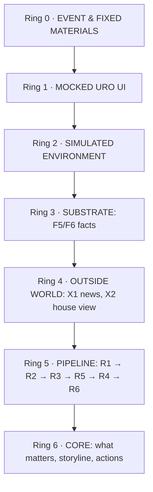
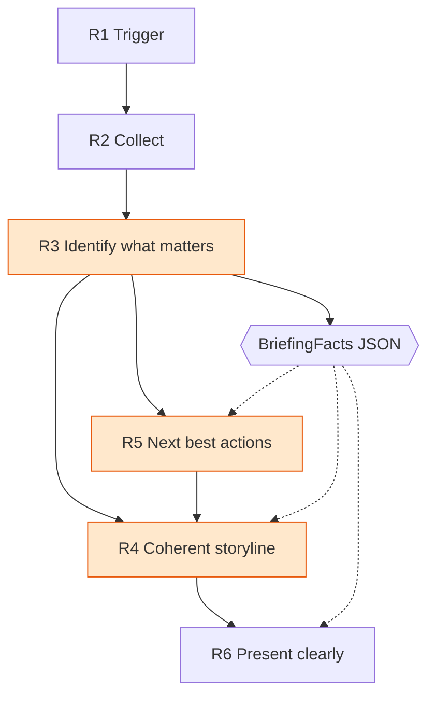

# UNRISKOMEGA — Project Overview (outside → inside)

**One line:** an AI briefing assistant for wealth advisors. The advisor clicks **Generate Briefing** and
gets a client-specific briefing readable in ~60 seconds, inside a **mocked** URO Advisor Pro interface.
It never runs inside the live URO environment.

**How to read this file.** The project is seven rings, outside to inside. Ring 0 is the world we cannot
change; ring 6 is the thing we are actually graded on. Each ring states what it is, what is built, its
status, and what breaks if it fails. Status legend:

| | Meaning |
|---|---|
| ☑ | built **and** verified by execution (2026-09-18) |
| ◐ | built with a named caveat, or spec'd but not fully covered |
| ☐ | not built |

`PROJECT.md` is the contract book · `PROJECT-NOTES.md` the raw verified data findings ·
`components/<ID>-*.md` the 19 per-component specs · `task_def.txt` the brief itself.

---

## 1. The rings at a glance

| Ring | Layer | What lives here | Status |
|---|---|---|---|
| **0** | The fixed world | Hackathon event, brief, provided materials — read-only, immutable | ☑ complete, nothing to build |
| **1** | Presentation wrapper | Mocked URO Advisor Pro: German UI, brand, measured visual fidelity | ☑ |
| **2** | Simulated working environment | F1 shell · F2 dashboard · F3 client detail · F4 portfolio · F7 intray | ☑ |
| **3** | Substrate (facts) | F5 data access · F6 CRM context · B1 ex-custody consolidation | ☑ |
| **4** | The outside world brought in | X1 real market news · X2 house/CIO view (declared mock) | ☑ |
| **5** | The pipeline we build | R1 trigger · R2 collect · R3 relevance · R5 actions · R4 storyline · R6 present | ☑ except R4's LLM variant |
| **6** | **The challenge core** | Decide what matters, tell the storyline, recommend actions — 4 questions, ~60 s, every claim traceable | ◐ engine works end-to-end, but **not AI-powered** and 5 named briefing items are missing — see §8 |
| sat | Cross-cutting satellites | B2 follow-up Q&A · B3 creative format · T1 regression harness | ☑ / ◐ |



Depth has a cost gradient: a defect in ring 1 is cosmetic, a defect in ring 6 is the whole score. That
is why the outermost rings are imitations and the innermost rings are the only place we spend
intelligence.

---

## 2. Ring 0 — The fixed world (input, not deliverable)

**What it is.** START Global × Swiss AI Weeks 2026, UNRISKOMEGA challenge. The brief is
`task_def.txt` (256 lines, read-only). The provided tree `unriskomega-2026/` holds everything we are
given and may never modify: 47 fictional clients over real instruments (`clients.json` 3.44 MB,
`reference.json` 14.61 MB, 12 collections), 3 reference UI screenshots, brand assets, a **measured UI
spec** (`ui_reverse/`, 7 documents: component table, design system, page specs, data models,
implementation guide, asset manifest, audit report), and 10 ex-custody PDFs (8 pages each, clean text
layer) for the side challenge.

**Status:** ☑ complete and verified — 47 clients · 57 portfolios · 703 security positions · 180
suitability violations · 206 proposals · 3'306 performance points · 504 securities · 48'101 fund
mappings. Nothing here is ours to fix.

**Two designed gaps** (per `task_def.txt` lines 158–173): market news and the bank's CIO view are
**absent on purpose** and must be sourced/mocked by us, linked to actual holdings. Everything in rings
3–5 exists because of those two gaps.

**If it breaks:** nothing to break — but misreading it is the most expensive error in the project. Two
documented README claims are wrong in the data (see ring 3), and the whole project's honesty rules come
from these landmines.

---

## 3. Ring 1 — The presentation wrapper (mocked URO Advisor Pro)

**What it is.** The layer the jury actually looks at: URO Advisor Pro chrome reproduced from supplied
screenshots, in German, with brand assets and Swiss number formatting. The brief's hard constraint: the
prototype must **never** run inside the live URO environment — so this ring exists to make the
prototype legible as a product without touching the bank's systems.

**Status: ☑.** `frontend/src/App.tsx` + `shell/{nav,ShellContext}.tsx` derive per-screen nav from the UI
spec with badges from real counts, never hard-coded. UI kit in `components/**`: Header · SecondaryNav ·
MetaBand · DataTable · Pagination · FilterTabs · SearchBox · ViolationIcon/WarningIcon · DonutChart ·
GaugeChart · ProgressBar · Card. Palette/typography measured from `ui_reverse/02-design-system.md`, not
eyeballed. `npm run typecheck` clean.

**If it fails:** credibility, not correctness. The numbers can be perfect and the demo still reads as a
hackathon page.

---

## 4. Ring 2 — The simulated working environment we replace

**What it is.** The systems the advisor would otherwise open one by one during a short-notice call. We
imitate them so the briefing has somewhere to come from.

| Screen | ID | Imitates | Status | Evidence |
|---|---|---|---|---|
| Advisor shell | F1 | URO chrome, nav, header | ☑ | badges published from live counts |
| Client overview | F2 | Advisor dashboard / client list | ☑ | 47 rows, real filter tabs `13/9/4/19/20/12`, book total `CHF 31'774'249.27`, integrity report |
| Client detail | F3 | The client record | ☑ | cards, Beratungen, notes, violations, declared gaps; `CASE-008` shows `Portfolio 210525 (unbekannt)` |
| Portfolio & positions | F4 | Portfolio analytics | ☑ | SAA target-vs-actual, positions, metric rail, splitting toggle; `CASE-007-01` Aktien `0.567046` vs target `0.75` (Aktion −18.30%) |
| Document intray | F7 | Custody statement store | ☑ | the 10 PDFs feed ring 3's consolidation |

**Status: ☑** — screens are navigable and served by the real API, not fixtures.

**If it fails:** the demo has no context to point at; also the trigger button (`R1`) lives here.

---

## 5. Ring 3 — The substrate: where the facts come from

**What it is.** The bank's data, flattened to files. Everything downstream is a projection of this ring.

| Component | ID | What it does | Status |
|---|---|---|---|
| Data access | F5 | Loads `clients.json` + `reference.json`, joins on `SecurityId`, computes metrics; the **only** code allowed to read raw JSON (`ingest.py`), exposes `opt`/`listof`/`num` to everyone else | ☑ `domain/{ingest,index,metrics}.py` |
| CRM context | F6 | Notes, tags, rule overrides, last activity, liquidity ratio | ☑ `domain/crm.py` — 153 notes, 53 distinct, 73 tag assignments, 3 overrides |
| Document intray consolidation | B1 | Parses the 10 ex-custody PDFs into a Fremdbanken portfolio | ☑ `domain/excustody.py` — lands at `CHF 2'049'658.00`, CHF 0.00 delta vs report |
| Extensibility | F5 | Accepts new client files of the same shape (the unseen-client drill) rather than hardcoding the dataset | ☑ `/api/dataset/*`, uploads in `data/uploads/` (currently empty = shipped state) |

**Design decisions forced by this ring** (detail in `PROJECT-NOTES.md` §4–§5): absent keys *and* explicit
nulls are both handled; the same ISIN may be several currency share classes; `FundUnbundlingMappings`
weights are 0–100 while positions/SAA are 0–1; comparisons use `SAA_*` fields; **violations are
display-only** (re-derivation disagrees on 15 of 46 portfolios) so they are explained from the engine's
own `ViolationPath`; `PerformanceYTD` is null everywhere and returns are computed from
`PerformanceHistory`; real IBANs are stripped at the API boundary and never rendered, logged or
transmitted.

**Status: ☑**, including the dirty cases: `CASE-008`/`CASE-038` (28 dangling portfolio refs),
`CASE-029`–`CASE-032` (no risk profile), crypto/metal account currencies (`BTC`, `ETH`, `SOL`, `SHIB`,
`OZG`).

**If it fails:** silently wrong numbers, which is worse than a crash. This ring is where the
"trust, not polish" standard is won or lost.

---

## 6. Ring 4 — The outside world brought inside

**What it is.** The two inputs the materials deliberately omit. In production these are licensed feeds;
here one is real and one is a declared mock.

| Input | ID | What we did | Status |
|---|---|---|---|
| Market news | X1 | **Real fetch**, filtered to actual holdings: rank holdings by weight, query only direct equities ≥2% (max 4), clean bank-style names (`Namen-Aktie VZ Holding AG` → `VZ Holding`), attach the holding's real weight to every headline, dedupe by URL *and* normalised title, disk cache, 12 s wall-clock deadline | ☑ `external/news.py` — Bing News primary, Google News + Yahoo fallback; `CASE-028` returns 8 dated headlines |
| House / CIO view | X2 | Curated mock, **declared as mock in the payload** (`mock: true` + German disclaimer) — the brief explicitly sanctions this | ☑ `external/house_view.py` + `data/house_view.json` — UBS CIO Market Outlook 2026, `as_of` 2025-12-10, 28 stances mapped to portfolios |

**Provider reality** (`PROJECT-NOTES.md` §12, verified from this network): Google News RSS returns HTTP
200 with an **empty body** for every query; Yahoo returns 0 items for `VZN.SW`. A single-provider design
would have looked verified while returning nothing. Only direct equities are queried — a fund has no
single-security coverage, so those positions are **declared unavailable** instead of padded with generic
"how to invest in ETFs" noise. That is why `CASE-007` (funds only) honestly says *"Marktkontext nicht
verfügbar"* while `CASE-028` (95.85% VZ Holding) gets real coverage.

**If it fails:** the briefing loses its "why now" — it degrades to a portfolio summary. It degrades
*visibly*: the market stage reports `status: "unavailable"` with a note rather than failing.

---

## 7. Ring 5 — The pipeline we build

**What it is.** The product half of the component map. `R1`–`R6` map one-to-one onto the brief's own six
"Minimum Product Requirements" — that sentence is the pitch.



`BriefingFacts` is the keystone contract: R3 produces it deterministically, R4/R5/R6/B2/T1 consume it.
One frozen shape is why these layers could be built one after another without rework.

| Component | ID | What it does | Status |
|---|---|---|---|
| Trigger | R1 | Generate Briefing button on F3/F4 | ☑ buttons in `ClientScreen`/`PortfolioScreen` → `openBriefing` → `#/client/{ref}/briefing` → `BriefingScreen`. `BriefingTrigger.tsx` was **deleted** 2026-09-19 (no importer; the real trigger is the `onBriefing` callback on F3/F4) |
| Context assembly | R2 | Collect from F5/F6/X1/X2/B1, stage-timed | ☑ `compose/facts.py` — now carries `instrument_candidates` from `domain/candidates.py` |
| **Relevance engine** | R3 | Score and select what deserves attention; every finding carries `label`/`value`/`source`/`path` | ☑ `domain/relevance.py` — **all 16 types fire** (added `sector_concentration` and `esg_alignment` 2026-09-19); 19 of 48 clients carry named instruments; 15 of 48 fire sector concentration; 1 of 48 breaches its ESG floor |
| Next best actions | R5 | Ranked actions citing findings | ☑ `compose/actions.py` — ≤5 candidates, ≤3 rendered + disclosure of the rest; **now emits `instrument_candidate` actions** (18 of 48 clients render one) with direction-accurate switch wording |
| Storyline composer | R4 | Three sections + the four questions, word budget enforced | ◐ template renderer ☑ `compose/render.py` · LLM renderer ☐ (no API key; request returns `400` rather than degrading silently) · **per-question `evidence_refs`** ☑ · market block in section 1 with different-issuer rule in section 3 ☑ |
| Presentation | R6 | Stages, traceability, declared gaps | ☑ `screens/briefing/` — evidence index renders to paths like `clients[CASE-028].Portfolios[CASE-028-01].SecurityPositions[0].PortfolioValuePercentage`; **per-answer evidence controls** ☑ |

Execution shape per briefing: `collect → analyse → rules → market → house_view → actions → compose`, each
stage measured and reported; unavailability is data, not an exception.

**If it fails:** the pipeline is the evidence chain — a failure here means claims without sources, which
is the one thing this project treats as fatal.

---

## 8. Ring 6 — The challenge core (the innermost ring)

**What it is.** The brief's real ask, and the only place we spend intelligence:

> *"The assistant should prioritize the most important findings instead of listing every available metric."*

Two to four things that matter for **this** client, a coherent storyline, concrete next best actions —
answering four questions in ~60 seconds, with every claim traceable and every gap declared. Everything in
rings 1–5 exists to make this ring possible; nothing in rings 1–5 is the point.

**The four questions and where they are answered:** *What happened?* → recent development and its drivers;
*What is the current situation?* → allocation deviation, risk, suitability, rule violations; *What could
happen next?* → the portfolio against market developments and the bank's view; *What should the advisor
do?* → next best actions.

**Three hard constraints this ring must not violate** (each is enforced in code, not by good intentions):

1. **No invented attribution.** The data has no cost basis and no position history, so *what drove the
   return* cannot be answered — only portfolio-level trajectory and **risk** contribution
   (`ContributionVolatility`, which reconciles to portfolio volatility). Say "risk contribution", never
   "performance contribution".
2. **Violations are display-only.** Explain from the engine's own trace, never re-derive.
3. **Gaps are declared, never filled.** No number is invented; no LLM computes a figure.

**Status: ◐ — the engine works end-to-end, but the brief's core items are not all met.** The table
below checks status **against `task_def.txt`**, not against our own tracker.

### 8.1 What the working engine does prove (verified today by execution)

| Check | Result |
|---|---|
| **All 47 clients through `POST /api/briefing`** | **47/47** return exactly the three brief sections in order, every one with blocks; **every** `evidence_refs` entry resolves in `evidence_index` |
| Findings surfaced | **626** total (~13 per client); **all 14 enum types fire** — the three new ones report 14 clients with recent executed trades, 31 open tasks across 25 clients and 16 portfolios holding idle cash |
| Length discipline | 124–225 words, median 215 (≈37–68 s at the renderer's own 3.33 words/s). The 210-word budget is a **target, not a ceiling**: every section keeps at least one block and the four answers are never trimmed, so 33 of 47 land slightly above it, and 6 data-thin clients read shorter. Every drop is disclosed in `trimmed_blocks` |
| Honesty | **47/47 declare at least one `meta.unavailable`** — universally `PerformanceYTD missing; returns computed from PerformanceHistory` |
| `CASE-007` Mary Poppins | 224 words / 67 s · 12 findings · 5 candidates (3 rendered, incl. a liquidity action — no illiquid advice against the property note) · 0 news items, declared |
| `CASE-028` Charles Foster Kane | 207 words / 62 s · 6 findings · 8 real headlines tied to the 95.85% VZ position |
| `CASE-027` Buzz Lightyear | 215 words · declares no coverage for `SpaceX Aktie`, still reports news for its other holdings |
| `CASE-034` (draft client) | 194 words · renders the `Entwurf` finding *and* a matching action |
| `CASE-008` / `CASE-029` | 211 / 210 words · complete without crashing; `CASE-029` also declares the missing risk profile |

**◐ what is not yet proven here:** the human checks — the two-minute advisor role-play, the 20–30 minute
manual vs ~60 second timing comparison, and a live unseen-client drill in front of an audience.

**If it fails:** rings 1–5 become an expensive mock-up. This ring is the score.

### 8.2 Coverage of `task_def.txt` — item by item

Legend: ✓ delivered · ◐ partial (reason given) · ☐ not built. Evidence is a path or a measured result.

| Brief requirement | State | Evidence / reason |
|---|---|---|
| **"AI-powered briefing assistant"** | ☐ | No LLM exists anywhere in the codebase. R4 is a **template** renderer and `renderer: "llm"` raises; R3 is deliberately deterministic rules. The prototype today is a rules engine, not an AI one. `compose/render.py:574` |
| Trigger from the mocked UI (min req 1) | ✓ | "Generate Briefing" on F3/F4 → `#/client/{ref}/briefing` → `BriefingScreen`; `screens/briefing/BriefingTrigger.tsx` is dead code (no importer) |
| Collect client/portfolio/security/CRM/news/house-view (2) | ✓ | `compose/facts.py` — 7 measured stages |
| Identify what matters, prioritise over listing metrics (3) | ✓ | R3, **16 types**, ranked by score; sections render a bounded selection and disclose every drop |
| **Create a coherent storyline (4)** | ◐ | Structure is coherent and single-sourced (one evidence index, three sections, four answers) — but the narration is **template-stitched, not AI-composed**. Whether that satisfies "coherent storyline" is exactly the same gap as row 1 |
| Recommend next best actions (5) | ✓ | Deterministic actions from findings (≤5 candidates, ≤3 rendered): rebalance, resolve violation, reduce concentration, follow a client preference, clarify an open proposal, put idle liquidity to work, follow up an open task, **and — as of 2026-09-19 — name a specific instrument to buy, sell or switch** (`instrument_candidate` action, 18 of 48 clients render one). 22 clients get a task action, 14 a reinvestment action |
| Present clearly, ~60 s (6) | ✓ | R6 + B3 one-pager + B2 Q&A; 124–225 words, ~37–68 s |
| §1 Recent portfolio performance | ✓ | `compose/facts.py` returns computed from `PerformanceHistory` |
| §1 Largest positive/negative **contribution** | ◐ | Delivered as **risk** contribution (`ContributionVolatility`, reconciles to portfolio volatility) — the data has no cost basis or position history, so performance attribution is impossible. Defensible, but it is not what the brief names |
| §1 Concentration (security/sector/currency/asset class) | ✓ | `_concentration`, `_fx_exposure`, allocation drift, **`_sector_concentration`** (15 of 48 clients fire at `SECTOR_HIGH` 0.50 / `SECTOR_MEDIUM` 0.30 on the top classified look-through industry) |
| §1 **Identifying securities to buy, sell or switch** | ✓ | **19 of 48 clients** carry at least one `instrument_candidate` move or buy from `domain/candidates.py`; **18 of 48** render an `instrument_candidate` action in the briefing. Names come only from the bank's own data: the five `Entwurf` proposals (4 clients, 31 moves at ≥1 pp) and `RecommendationLists` members in an underweight SAA class (16 clients). `compose/actions.py` emits the action; `compose/render.py` renders the block; `compose/qa.py::_answer_instruments` routes follow-up questions |
| §1 Relevant market events connected to movements | ✓ | X1, `relevant_because` carries the holding weight |
| §2 Deviation from the SAA | ✓ | `CASE-007-01` Shares 56.70% vs 75.00% (Aktion −18.30%) |
| §2 Suitability / investment-rule violations | ✓ | 180 violations, display-only, explained from `ViolationPath` |
| §2 Risk-profile alignment | ✓ | `_risk_alignment` as context, never as a self-declared violation |
| §2 Concentration risks | ✓ | `_concentration` |
| §2 Client-specific restrictions or preferences | ✓ | `_preference_conflict` from notes (CASE-017 fossil vs Neste works); **`_esg_alignment`** (1 of 48 portfolios breaches its ESG floor — `CASE-016-01` at score 3.10 vs floor 5.714, ranked `high`/0.6 so it survives the trim; 0 engine violations of `Sustainable investments only`, so it is an observation, never a verdict). Tags are collected into `BriefingFacts` and render as an evidence-backed context block (35 of 48 tagged clients) |
| §2 **Open investment proposals** | ◐ | Fixed today — but the line survives the word budget for only `CASE-034` of the 5 draft clients |
| §2 **Pending tasks** | ✓ | Derived from notes (the data has no task field): 31 items across 25 clients, each citing its own note, deduplicated against notes other findings already use. `relevance._pending_task` |
| §2 **Reinvestment opportunities** | ✓ | New `reinvestment` type owns cash: idle liquidity above both its SAA target by 5 pp and the product's 10% mark. 16 portfolios fire, and the cash category no longer doubles as an `allocation_drift` |
| §2 Notes / tags / previous interactions | ◐ | Notes ✓ (preference, liquidity and now task findings); previous interactions ✓ (the trades since the window, via `material_change`); **tags remain collected but unused** |
| §3 Relevant developments + why they matter **for this client** | ✓ | `relevant_because`, house-view `matches` |
| §3 Distinguish portfolio facts from external context | ✓ | `source_kind`: portfolio · external · mock · gap, rendered with visual separation |
| §3 Support recommendations with the underlying data | ✓ | Every fact block carries resolvable `evidence_refs`; 47/47 verified |
| §3 Avoid generic or unsupported statements | ✓ | No evidence ⇒ no claim; gaps declared (`47/47` declare ≥1) |
| **Goal: the likely questions the client may raise** | ✓ | `briefing.client_questions` — up to three per client, each derived from an existing finding and carrying its evidence refs. **47/47 clients get at least one** (3 for 40 clients, 2 for 6, 1 for one). Rendered in R6 as *"Mögliche Fragen des Kunden"* with a trace button per question; excluded from the 60-second word count by design |
| Unseen test client before the final | ✓ | `POST /api/dataset/clients/json` + reload; verified with a synthetic client |
| Final presentation: live demo + PowerPoint | ☐ | No deck exists in the repo (`.pptx`/slide files: none); the demo path itself works |
| Which elements use mock data / production integrations | ✓ / ☐ | X2 declares `mock: true` + disclaimer ✓; the production-integration story is doc-level only, not in a deck |
| Bonus: ex-custody import | ✓ | 10 PDFs parsed, `CHF 2'049'658.00`, CHF 0.00 delta |
| Bonus: interactive follow-up assistant | ✓ | `/api/qa` grounded in the same evidence bundle, states unavailability |
| Bonus: creative format | ✓ | print one-pager in `screens/creative/` |

**Two rows are still ☐ and five are ◐.** Four of the six gaps found on 2026-09-18 are now closed —
material changes since the previous interaction, pending tasks, reinvestment opportunities and the
anticipated client questions. What remains: **no LLM anywhere** (so "AI-powered" and the AI-composed
storyline still rest on nothing), the tags that are collected but never used, and the presentation deck.
Details and effort in §12.

---

## 9. Satellites — built on the same core, not rings

| Component | ID | What it adds | Status |
|---|---|---|---|
| Follow-up Q&A | B2 | Ask follow-ups over the same `BriefingFacts` evidence bundle; answers carry evidence, or say unavailable | ☑ `compose/qa.py`, `api/qa.py`, `QaPanel.tsx` |
| Creative format | B3 | Alternative rendering of R6: print one-pager | ☑ `screens/creative/` |
| Regression harness | T1 | 47 clients headless → canonical JSON → snapshot diff | ☑ F2/F3/F4 projections for all 47 (2 tests, snapshots + `--diff`, baseline regenerated 2026-09-19 and diff-clean — re-diffed clean after the parallel lane's F5 and news changes) · R3 regression tests (17) · **all-47 briefing invariants (10 tests: sections, questions, traceability, ≤5 action candidates, word band, gaps, no IBAN, determinism, language switch)** · **risk-figure guards (5)** · **named-candidate contract (12)** · **150 passed + 1 skipped**, no network — re-count with `pytest -q`, this number moves with every wave |

---

## 10. Cross-cutting invariants (they hold in every ring)

- **Traceability** — every factual block carries resolvable `evidence_refs`. A block with none is
  rendered as a muted disclosure note, never as a claim.
- **Graceful refusal** — gaps go to `data_gaps` / `meta.unavailable` and are visible in the UI.
- **Determinism** — no randomness anywhere; derived values are relative to `data_as_of` (2026-09-03),
  never the wall clock.
- **Privacy** — real IBANs stripped at the API boundary by `redact()`; tested.
- **Language** — bilingual, **English by default**, German via the header switch / `?lang=de`. Since the
  2026-09-19 website-bug wave the three section **titles are localized too** (DE: *Jüngste
  Portfolioentwicklung* · *Portfolio-Gesundheitscheck* · *Portfolio-Ausblick & nächste Massnahmen*), while
  their stable `id`s stay English for every consumer and for the snapshots. This **departs from the brief's
  own English section names** — say so out loud if a judge reads the German briefing against `task_def.txt`.
  Resolved the same day: the F4 rail was the last German-only surface (`rail_widgets(client, portfolio, lang)`)
  and the positions header no longer renders the literal `{currency}` placeholder — it prints the portfolio
  currency.
- **Risk honesty** — a risk figure that cannot be true is withheld and declared. One position in the case
  data overflows (`CASE-041-01` / `XS1412417617`: `MarginalContributionToRisk` 9'223'372.03685 →
  `ContributionVolatility` 574'339.3767 against a volatility of 0.098). `metrics.risk_contributions()`
  drops it, F4 serves `null` + `risk_figure_dropped` + a gap, and R3 skips the risk driver for a portfolio
  with no usable series. Guarded by `tests/test_risk_guard.py`.
- **Mock disclosure** — X2 declares itself mock in its own payload.

Measured state, 2026-09-19 (re-measured after the website-bug wave and the parallel lane below): `pytest -q` → **150 passed, 1 skipped** in
~14 s (the skip is the harness drill without `--run-harness`) · harness `--out tests/snapshots` → 48
files, `--diff` against a fresh run → **clean** (the committed baseline had drifted on all 47 clients
after the bilingual refactor; it was stale, never wrong — 0 numeric diffs) · `npm run typecheck` →
**clean** · `GET /api/health` → `ok`, `data_as_of 2026-09-03`, `engine_version 0.1.0`, counts
47/57/504/48'101 · `data/uploads/` currently holds **`scen-001.json`** (the brief's Example Scenario drill
client, `SCEN-001`), so the live process serves 48 clients / 58 portfolios; `data/excustody/` is cleared. Delete that upload and reload for the shipped 47-client state.

Fixed on 2026-09-19 (each with a test): the overflowing `ContributionVolatility` in `CASE-041` (withheld
+ declared, never rendered), the F4 rail's German-only labels and the `{currency}` placeholder, the
hard-coded gap strings in a German-only catalogue, the house-view matcher comparing look-through
fine-taxonomy weights against SAA categories (it reported `Shares 4.9%` for a 56.7% holding), the
brief's five B2 example questions (which were answered with volatility or not at all), the ex-custody
panel's duplicate auto-import, and the missing provenance on imported portfolios.

**Fixed in the audit wave of 2026-09-19 (cross-check against `task_def.txt`, nothing trusted on faith):** news title-dedupe
(read `headline`, not `title`) plus a 365-day age filter and cache-primary-within-6h fetching (briefings of the same
client are now stable); Q&A routes violation questions to `facts.violations` instead of proposals; every evidence
path either resolves verbatim in the raw JSON or is `source: "computed"` with a named aggregation (resolver gate in
`tests/test_relevance.py` over all 47 clients); draft proposals render for all five draft clients (`medium`/0.55);
the market stage reports `unavailable` with a note and the briefing narrates it; DE and EN render the identical
block selection (trim plan computed on the English rendering); DE tab labels and the portfolio endpoint's `lang`
field fixed; client tags surface as an evidence-backed context block (35/35 tagged clients); short histories get a
declared available-span return; the ex-custody 409 is structured and localized in the UI; the shell nav buttons
navigate (dashboard tabs / screen sections) and destination-less items are disabled with a tooltip; snapshot
baseline regenerated clean; final deck at `presentation/UNRISKOMEGA-briefing-assistant.pptx`.

**Fixed in the parallel lane of 2026-09-19 (backend-only, while the website-bug wave owned the UI and the**
**hot composer files; both audit logs are now consolidated into `STATUS.md`):** the multi-word news query preamble (
`_QUERY_NOISE_PREFIXES` held `"na. u. inh. ti.-aktie"` but `_clean_query_name` compared single tokens, so 13
master rows were searched with their German share-class preamble; now matched as phrases, longest first:
13 rows change, 0 regressions, and ASML goes from **1** cached generic headline to **5** live on-topic ones,
two of them from September 2026 — which is what the brief's drawdown scenario needs); the `PROJECT.md`
documentation drift then recorded in the old audit log (test count, the real violation shape
`id`/`portfolio_known`/`explanation`/`values` instead of `has_trace`/`trace`, the `1234`-vs-`29509` example
ids, the four duplicated `/api/dataset/*` rows and the orphaned body bullets, CASE-027's "no price" claim,
`error_level` vs `severity`, plus `src/README.md`'s test count and its "the UI is German" line); the market
ordering that the preamble fix exposed — `fetch_market_context` sorted every headline by date alone, so R4's
lead market line went to the *newest* holding rather than the largest: SCEN-001 narrated Qualcomm at 18%
while ASML at 62% had four fresher-dated rivals, and now leads with ASML (weight first, newest within it,
`tests/test_news_fixes.py` pins it); and the data half of the brief's last unnamed action — see §12.

---

## 11. Demo script (ring 6 in front of an audience)

| Client | Story |
|---|---|
| `CASE-007` Mary Poppins | property-purchase note → illiquid advice is wrong; max-vol breach 0.1264 vs 0.12; 56.70% shares vs a 75% target |
| `CASE-028` Charles Foster Kane | 95.85% VZ Holding, real dated headlines carrying the position weight |
| `CASE-027` Buzz Lightyear | private instrument, no coverage → declared gap |
| `CASE-017` | note says avoid fossil fuels, holds Neste (Energy); the rule engine flags nothing — pure AI value-add |
| `CASE-012` | 82.19% USD against a foreign-currency flag |
| `CASE-008` | broken references — completes, declares them |

Close with the contrast: 20–30 minutes across systems, manual, vs ~60 seconds and fully traced.

---

## 12. Open items, by ring

| Ring | Item | Impact |
|---|---|---|
| 6 | **No LLM anywhere.** The challenge says *"AI-powered briefing assistant"*; R4 is a template renderer, `renderer: "llm"` raises, and R3 is deterministic by design | **The headline gap that remains.** Cheapest close: build the second R4 implementation behind the existing `renderer` switch — feed it `BriefingFacts` + the template blocks and let it rephrase only. Needs an API key. Nothing upstream changes |
| 6 | **"Largest positive or negative contribution"** | Cannot be performance attribution (no cost basis, no position history). Keep the honest substitution (risk contribution) and say so out loud; do not fake it |
| ~~6~~ | ~~Tags are carried into `BriefingFacts` but never used by a finding or block~~ | **closed 2026-09-19 (audit wave)** — tags render as an evidence-backed context block in the health check, 35/35 tagged clients, trim-protected at medium rank |
| ~~6~~ | ~~Draft proposals reach the rendered briefing only for `CASE-034`~~ | **closed 2026-09-19 (audit wave)** — `open_proposal` raised to `medium`/0.55; all five draft clients render the line |
| ~~—~~ | ~~Final presentation: no PowerPoint deck exists~~ | **closed 2026-09-19** — `presentation/UNRISKOMEGA-briefing-assistant.pptx`, 10 slides covering the nine named points |
| ~~5/6~~ | ~~**Wire `domain/candidates.py` into R5 and R4.** The data half of *"securities to buy, sell or switch"* is built and tested (19 of 47 clients get a name); the action, the block and the words do not exist yet~~ | **closed 2026-09-19 (integration wave)** — `compose/actions.py` emits `instrument_candidate` actions (18 of 48 clients render one); `compose/render.py` renders the block in section 3; `compose/qa.py::_answer_instruments` routes follow-up questions; 19 of 48 clients carry at least one nameable instrument |
| ~~4~~ | ~~The news query for a multi-word German preamble was never cleaned (ASML searched as "Na. u. Inh. Ti.-Aktie ASML Holding NV" → 1 headline)~~ | **closed 2026-09-19 (parallel lane)** — phrase matching in `news._clean_query_name`, 13 master rows fixed, live proof 1 → 5 headlines, `tests/test_news_fixes.py` +6 |
| ~~—~~ | ~~`PROJECT.md` documented a violation shape and API rows the code does not emit~~ | **closed 2026-09-19 (parallel lane)** — §5.2 violations, §5.5 deduplicated, §7 rules 16–19 added, §10/§9 CASE-027 corrected |
| 6 | Human checks: advisor role-play, timing comparison, live unseen-client drill | presentation risk only |
| ~~5~~ | ~~T1 does not snapshot briefings: no all-47 briefing invariants, no determinism check, no IBAN scan on briefing payloads~~ | **closed 2026-09-19** — `tests/test_briefing_contract.py` + `tests/test_risk_guard.py`, offline and deterministic; the committed baseline was regenerated |
| 5 | 43 of 48 briefings land **above** the 210-word budget (median 224, max 231 words; read time 62 / 67 / 69 s) because the four answers are never trimmed and every section keeps at least one block | `~60 s` is still met (max 69 s), but the budget is a target, not a ceiling — either accept it or make the answers trimmable |
| 5 | Data-thin clients read short (thinnest: `CASE-024`, 124 words / 37 s, 3 findings) | padding would be invention, so we own the explanation |
| 4 | Confirm the X2 publication we want to defend (currently UBS CIO Market Outlook 2026, declared mock) | a judge may ask for provenance |

---

## 13. Ground rules (apply in every ring)

**Never** modify `unriskomega-2026/` or `task_def.txt` · read raw JSON outside F5 · let an LLM compute a
number · render, log or transmit an IBAN · invent data to fill a gap · introduce randomness · emit a
finding with empty evidence.

**Always** handle absent *and* null · format money Swiss-style (`1'234.56`, `5.20 %`) · keep every
user-facing string in both languages (English default, German on request; data values are never
translated) · declare mock data as mock · withhold a figure that cannot be true and declare the gap ·
make each component runnable and testable on its own · keep derived values relative to `data_as_of`.

---

## 14. Run it

```
cd src/backend && python -m uvicorn app.main:app --reload --port 8000   # API + /docs
cd src/frontend && npm install && npm run dev                           # UI on 5173, proxies /api

cd src/backend && python -m pytest -q                                   # 150 tests + 1 skipped
cd src/backend && python -m pytest tests/test_harness.py --run-harness  # 47 clients -> snapshots
cd src/frontend && npm run typecheck
```

Before any demo: ensure `data/uploads/` is empty **and** clear the ex-custody store, which a dataset
reload does not touch:

```
curl -X POST   localhost:8000/api/dataset/reload
curl -X DELETE localhost:8000/api/import/imported     # 59 -> 57 portfolios
```

Or run the backend with `URO_DATA_DIR` / `URO_EXCUSTODY_DIR` pointing at a different dataset root, and
`URO_NEWS_OFFLINE=1` for an offline run.

## 15. Document index

| File | Read it for |
|---|---|
| `task_def.txt` | the brief (read-only) |
| `STATUS.md` | **current truth** — brief compliance line by line, measured state, the three open items. Supersedes the deleted `REVIEW.md` / `WEBSITE-BUGS.md` / `PRESENTATION-PACK.md` |
| `PROJECT.md` | frozen contracts, component map, build order, as-built module surface |
| `PROJECT-NOTES.md` | verified data inventory, doc-vs-data contradictions, landmines, demo cases, news-provider reality |
| `components/<ID>-*.md` | one file per component (19) |
| `PROJECT-OVERVIEW.md` | this file — the ring model |
| `src/README.md` | layout, run commands, endpoints, contract conventions |
| `unriskomega-2026/ui_reverse/` | measured UI spec — the visual fidelity source |
| `unriskomega-2026/core-case/portfolio-data/DATA.md` | provided data reference |
