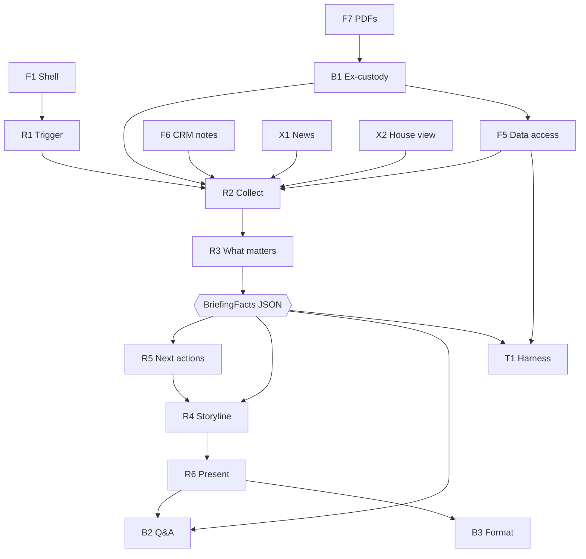

# UNRISKOMEGA — Project Guide

**This is the file every build agent reads first.** It defines what we are building, the frozen
contracts between components, and the rules nobody may break. Component-specific instructions live in
`docs/components/<ID>-*.md`.

Raw verified findings about the provided data live in `docs/PROJECT-NOTES.md` — read §4 and §5 there
before touching data.

**Want the whole project on one page?** `PROJECT-OVERVIEW.md` in this folder: the layer map, the
architecture, what is verified by execution, the demo script and the open items.

---

## 1. What we are building

A prototype **AI briefing assistant** for wealth advisors, presented inside a **mocked** URO Advisor Pro
interface. The advisor clicks **Generate Briefing** and receives a client-specific briefing readable in
about 60 seconds.

Trigger: a short-notice client call. The advisor must otherwise review performance, allocation,
suitability, investment rules, open proposals, client notes, market developments and the bank's
investment view across several systems.

The briefing answers four questions:

1. **What happened?** — recent development and its main drivers
2. **What is the current situation?** — allocation deviations, risks, suitability issues, rule violations
3. **What could happen next?** — the portfolio against market developments and the bank's view
4. **What should the advisor do?** — concrete next best actions

Delivered as three sections: *Recent Portfolio Development*, *Portfolio Health Check*,
*Portfolio Outlook & Next Best Actions*.

**The prototype must never run inside the live URO environment.**

Full brief: `task_def.txt` at the repo root.

---

## 2. Component map

Two questions decide every component:

- Already exists at URO? → we **imitate** it (frame).
- Is it what the brief asks for? → we **build** it (product).

### Frame (F) — systems URO already runs; we imitate them

- `F1` Advisor workspace shell — URO Advisor Pro chrome: nav, layout, header
- `F2` Client overview screen — the client list / advisor dashboard
- `F3` Client detail screen — the client record
- `F4` Portfolio & positions screen — the portfolio analytics view
- `F5` Data access layer — URO's database; here a flat-file loader
- `F6` CRM context source — the bank's CRM; here notes + tags
- `F7` Document intray — the custody statement store; here the 10 PDFs

### External inputs (X) — licensed feeds in real life

- `X1` Market news service — here: real fetch, filtered to actual holdings
- `X2` House / CIO view — here: a curated mock (the brief sanctions this)

### Product (R) — the brief's six requirements, verbatim

- `R1` Trigger — *"Trigger the briefing"* — mechanical
- `R2` Context assembly — *"Collect the relevant data"* — mechanical
- `R3` Relevance engine — *"Identify what matters"* — **intelligent**
- `R4` Storyline composer — *"Create a coherent storyline"* — **intelligent**
- `R5` Next best actions — *"Recommend next best actions"* — **intelligent**
- `R6` Briefing presentation — *"Present the result clearly"* — mechanical

### Bonus (B) — also the brief's own wording

- `B1` Ex-custody import — `F7` PDFs → a `F4` Fremdbanken portfolio
- `B2` Follow-up Q&A — reads the R2/R3 evidence bundle
- `B3` Creative format — an alternative rendering of `R6`

### Internal (T) — not a deliverable

- `T1` Regression harness — all 47 clients headless → JSON → diff

### Status tracker

| ID | Component | Status |
|---|---|---|
| F5 | Data access layer | ☑ `domain/{ingest,index,metrics,rail}.py`, `/api/clients*`, `/api/dataset/*` |
| F6 | CRM context source | ☑ `domain/crm.py` (notes, tags, overrides) |
| F1 | Advisor workspace shell | ☑ `src/frontend/src/App.tsx` + `components/**` |
| F2 | Client overview screen | ☑ `screens/dashboard/` (real tabs, sort, paging, search) |
| F3 | Client detail screen | ☑ `screens/client/` (cards, Beratungen, notes, violations) |
| F4 | Portfolio & positions screen | ☑ `screens/portfolio/` (SAA, positions, rail, splitting toggle) |
| X1 | Market news service | ☑ `external/news.py` — Bing → Google → Yahoo, cached, deadline-bounded |
| X2 | House / CIO view | ☑ `external/house_view.py` + `data/house_view.json`, declared as mock |
| R1 | Trigger | ☑ "Generate Briefing" on F3 (`ClientScreen`) and F4 (`PortfolioScreen`) → `openBriefing` → `#/client/{ref}/briefing` → `BriefingScreen`. `screens/briefing/BriefingTrigger.tsx` was **deleted** 2026-09-19 (no importer; the real trigger is the `onBriefing` callback on F3/F4) |
| R2 | Context assembly | ☑ `compose/facts.py` (stage-timed) · now carries `instrument_candidates` from `domain/candidates.py` |
| R3 | Relevance engine | ☑ `domain/relevance.py` (all **16** finding types — added `sector_concentration` and `esg_alignment` 2026-09-19) |
| R4 | Storyline composer | ◐ template renderer ☑ `compose/render.py`; LLM variant ☐ (no API key) · per-question `evidence_refs` ☑ · market block in section 1 with different-issuer rule in section 3 ☑ |
| R5 | Next best actions | ☑ `compose/actions.py` · the brief's "securities to buy, sell or switch" now **rendered**: `instrument_candidate` action type with `finding_refs` discipline, direction-accurate switch wording, 18 of 48 clients get one |
| R6 | Briefing presentation | ☑ `screens/briefing/` (traceability, stages, gaps) |
| B1 | Ex-custody import | ☑ parse + **bind**: `domain/excustody_store.py` attaches the import to a client, so it reaches F3/F4 and the briefing |
| B2 | Follow-up Q&A | ☑ `compose/qa.py`, `api/qa.py`, `QaPanel` |
| B3 | Creative format | ☑ `screens/creative/` (print one-pager) |
| T1 | Regression harness | ☑ `tests/` — the count lives in §11 only, so it cannot drift twice; snapshots for all 47 clients |
| i18n | Bilingual EN/DE | ☑ `app/i18n.py` + `src/i18n/` — English default, `?lang=`, every user-facing string catalogued |

---

## 3. Architecture



The **`BriefingFacts` JSON is the keystone contract**. `R3` produces it deterministically; `R4`, `R5`,
`R6`, `B2` and `T1` all consume it. Freeze it early — everything else can then be built in parallel.

### Repo layout

```
D:/hack26/
├─ task_def.txt                    the brief (read-only)
├─ unriskomega-2026/               provided materials — NEVER MODIFY
│  └─ ui_reverse/                  measured UI spec (visual fidelity source, read-only)
├─ notes-task/                     our docs
│  ├─ PROJECT-NOTES.md             raw verified findings (reference)
│  ├─ PROJECT.md                   ← this file
│  └─ components/                  ← one file per component
├─ src/                            everything we build
│  ├─ backend/
│  │  ├─ pyproject.toml
│  │  └─ app/
│  │     ├─ main.py                FastAPI app, CORS, routers
│  │     ├─ domain/                F5 (ingest, index, metrics), F6 (crm), rail, R3 relevance
│  │     ├─ external/              X1 news, X2 house view
│  │     ├─ compose/               BriefingFacts assembly + R4 renderers (wave 2)
│  │     └─ api/                   HTTP routers + schemas.py (the frozen JSON contract)
│  ├─ backend/tests/               T1 harness + F5 contract tests
│  └─ frontend/                    F1 (shell), F2–F4, R1, R6, B3 (React + Vite + TS)
│     └─ src/
│        ├─ components/            shared UI kit (Header, Nav, MetaBand, DataTable, charts)
│        ├─ screens/               dashboard/ client/ portfolio/ (+ briefing/ in wave 2)
│        ├─ shell/                 nav config + badge context
│        ├─ api/client.ts          typed API client
│        ├─ types.ts               mirrored contract types
│        └─ utils/format.ts        Swiss formatting
```

---

## 4. Stack

- **Backend:** Python 3.12 + FastAPI + uvicorn, dependencies via `uv`.
- **Frontend:** React + Vite + TypeScript via npm (`bun` is not installed).
- **Data:** the two JSON files, read from disk. No database.
- **LLM:** optional. Only `R4`/`R5` wording. See §6.

Run: from `src/backend/` — `python -m uvicorn app.main:app --reload --port 8000` (the ambient Python 3.12
already has every dependency; `uv run uvicorn app.main:app --reload` also works if you prefer an isolated
venv). From `src/frontend/` — `npm install` once, then `npm run dev` (Vite on 5173, proxying `/api` to
`127.0.0.1:8000`).

---

## 5. Contracts — frozen, do not change without updating this file

### 5.1 Data normalisation (owned by `F5`)

The provided JSON uses **both absent keys and explicit `null`** — see `PROJECT-NOTES.md` §4. No component
may touch raw JSON. All access goes through `F5`'s helpers:

```python
opt(obj, key)        # -> value or None; treats missing and null identically
listof(obj, key)     # -> list; missing, null, or wrong type all become []
num(obj, key, d=0.0) # -> float, never None
```

`obj.get(key, [])` is a bug: a present-but-null key returns `None` and breaks `.len()`.

### 5.2 `BriefingFacts` — the keystone

```jsonc
{
  "client": {
    "ref": "CASE-007",              // ClientRef — the human-facing id
    "display_name": "Mary Poppins",
    "type": "Professional client",
    "is_company": false,
    "reporting_currency": "CHF",
    "aum": 905454.0,
    "risk_profile": { "id": 17, "name": "Anlageprofil 5",
                      "max_vola": 0.12, "max_prc": 7 },   // null if unavailable
    "esg_profile": "Yes",           // or null
    "tags": [ { "name": "Rest of Europe", "type": "Region" } ],
    "overrides": [ { "rule_code": "…", "description": "…" } ]
  },
  "portfolios": [{
    "id": 29509, "nr": "CASE-007-01", "name": "Depotberatung",
    "currency": "CHF", "aum": 905454.0,
    "volatility": 0.09182, "expected_return": null, "value_at_risk": null,
    "return_12m_pct": 15.15,        // COMPUTED from PerformanceHistory
    "return_3m_pct": 7.67,
    "top_weight": 0.1172,           // largest single line, straight from metrics.concentration
    "top_security": "iShares Swiss Dividend ETF",
    "currency_exposures": [         // the same rows F4's rail shows, for the follow-up Q&A
      { "category": "Swiss francs", "label": "Swiss francs", "value": 720804.0, "weight": 0.7963 }
    ],
    "position_currencies": [        // position currency → group, so "EUR" can resolve to "Euro"
      { "code": "CHF", "group": "Swiss francs", "weight": 0.7963 }
    ],
    "data_gaps": ["PerformanceYTD missing"]      // never silently omitted
  }],
  "findings": [{
    "id": "f1",
    "type": "concentration",        // see the enum in §5.4
    "severity": "high",             // high | medium | low
    "score": 0.87,                  // R3 prioritisation score
    "portfolio_id": 29509,
    "title": "95.9% in a single stock",
    "detail": "Human-readable explanation.",
    "evidence": [{
      "label": "VZ Holding weight",
      "value": 0.959,
      "source": "clients.json",
      "unit": "ratio",              // "ratio" = a 0–1 value the prose states as a percentage,
      "path": "clients[CASE-028].Portfolios[0].SecurityPositions[0].PortfolioValuePercentage"
    }]                             //   so the evidence card shows 95.90%, not 0.959
  }],
  "market_context": [{
    "headline": "…", "source": "…", "url": "…", "published": "…",
    "linked_security_ids": [4908],
    "linked_sectors": ["Materials"],
    "relevant_because": "Client holds 95.9% VZ Holding."
  }],
  "house_view": {
    "source": "…", "as_of": "…",
    "stances": [ { "dimension": "AssetClass", "category": "Shares",
                   "stance": "overweight", "note": "…" } ],
    "matches": [ { "category": "Shares", "relation": "portfolio underweight",
                   "portfolio_id": 29509, "evidence": [] } ]
  },
  "actions": [{
    "id": "a1", "priority": 1,
    "action": "Rebalance toward the agreed 75% equity target",
    "rationale": "…",
    "finding_refs": ["f1"], "evidence": []
  }],
  "violations": [{
    "id": 231263,                     // SuitabilityViolations[].Id
    "rule_code": "Compliance with maximum volatility",
    "rule_description": "Für Privatkunden … muss PF Vola < max Kundenprofil Vola sein.",  // the violation's OWN
    "severity": "Error", "error_level": 0,                     // text; ``SuitabilityRules`` has 54 rows but
    "portfolio_id": 29509, "portfolio_nr": "CASE-007-01",       // only 53 distinct RuleCodes, so a lookup
    "portfolio_known": true,                                    // by code can name the wrong region (§7.14).
    // ``portfolio_known`` is false when the violation names a portfolio id no client carries (§7.9).
    // Colour, icons and sorting key off ``severity`` — ``error_level`` is not monotonic with it (§7.16).
    // The engine's own comparison — the ONLY sanctioned way to explain a violation:
    "explanation": [ { "field": "SimulationVolatilityRuleField`1", "label": "Volatility",
                       "unit": "ratio", "left": 0.126383759363, "right": 0.12, "operator": 40,
                       "path": "clients[CASE-007].SuitabilityViolations[0].ViolationPath[1]" } ],
    "values":      [ { "field": "SimulationVolatilityRuleField`1", "label": "Volatility",
                       "value": 0.126383759363, "limit": 0.12, "unit": "ratio", "source": "clients.json",
                       "path": "clients[CASE-007].SuitabilityViolations[0].ViolationPath[1]" } ]
  }],
  "market_meta": {
    "providers_used": ["google"], "fetched_at": "…",
    "is_mock": false, "notes": [], "unavailable_items": []
  },
  "instrument_candidates": {       // named instruments — the brief's "buy, sell or switch"
    "scope": { "client_ref": "CASE-045", "portfolio_nr": null },
    "moves": [{                    // what an open (Entwurf) proposal buys or sells
      "direction": "sell", "reason_code": "proposal_exit",   // buy | sell; 4 proposal_* reasons
      "isin": "CH0012005267", "name": "Namen-Aktie Novartis AG", "security_id": 264,
      "asset_class": "Shares", "industry": "Health Care", "in_recommendation_list": true,
      "current_weight": 0.4103, "target_weight": 0.0, "delta": -0.4103,
      "amount": 139320.17, "amount_currency": "CHF",         // never converted (§7.19)
      "proposal_id": 24746, "proposal_status": "Entwurf", "portfolio_nr": "CASE-045-01",
      "evidence": [ … ] }],                                   // non-empty on EVERY row (§8)
    "buys": [{                     // a recommendation-list member for an underweight SAA class
      "direction": "buy", "reason_code": "underweight_saa_class", "rank": 1,
      "name": "Namen-Aktie Swisscom AG", "security_id": 2686, "isin": "CH0008742519",
      "target_category": "Shares", "target_weight": 0.75, "actual_weight": 0.567046,
      "difference": -0.182954, "currency": "CHF", "currency_group": "Swiss francs",
      "volatility": 0.14358, "prc": 3.0, "sustainability_score": 7.2,
      "recommendation_lists": ["Recommendation list free assets"],
      "ranked_by": ["currency_group_match", "volatility_ascending", "name"], "evidence": [ … ] }],
    "buy_pools": [{ "category": "Shares", "pool_size": 140, "offered": 3,
                    "excluded_by_preference": 3 }],           // every drop disclosed
    "excluded": [{ "name": "Namen-Aktie Exxon Mobil Corp", "industry": "Energy",
                   "keyword": "fossil", "note_path": "clients[CASE-007].ClientNotes[1]" }],
    "gaps": [{ "code": "saa_unavailable", "portfolio_nr": "CASE-038-01" }]   // codes, not prose
  },
  "meta": {
    "generated_at": "…", "data_as_of": "…",
    "unavailable": ["Risk profile unavailable for this client"],
    "engine_version": "0.1.0"
  }
}
```

### 5.3 Briefing output (owned by `R4`, rendered by `R6`/`B3`)

```jsonc
{
  "client_ref": "CASE-007",
  "client_name": "Mary Poppins",
  "renderer": "template",           // or "llm"
  "sections": [
    { "id": "recent_development", "title": "Recent Portfolio Development",
      "blocks": [ { "text": "**CASE-007-01 ist über 12 Monate gestiegen: +15.15%**, …",
                    "evidence_refs": ["portfolio:CASE-007-01:return_12m_pct"],
                    "severity": null,               // high | medium | low | null
                    "source_kind": "portfolio" } ] },// portfolio | external | mock | gap
    { "id": "health_check", "title": "Portfolio Health Check", "blocks": [] },
    { "id": "outlook_actions", "title": "Portfolio Outlook & Next Best Actions", "blocks": [] }
  ],
  "questions": {
    "what_happened": "…", "situation": "…", "next": "…", "should_do": "…",
    "evidence_refs": ["portfolio:scope:return_12m_pct"],  // == what_happened_refs, kept for compatibility
    // Each answer carries its OWN refs and every one is a key of evidence_index. A bare finding id
    // ("f3") is NOT a valid key — resolve it through EvidenceIndex.from_finding. should_do_refs is
    // legitimately empty for a client with no actions; the UI then renders no control at all.
    "what_happened_refs": ["portfolio:scope:return_12m_pct", "finding:f8"],
    "situation_refs": ["finding:f1#0", "finding:f2#1"],
    "next_refs": ["market:https://…", "house_view:Shares:29509"],
    "should_do_refs": ["finding:f3#0"]
  },
  "client_questions": [            // the brief's "likely questions the client may raise"
    { "question": "Do we still hold what I asked you to avoid?",
      "evidence_refs": ["finding:f5", "finding:f5#0"] }
  ],
  "evidence_index": { "<ref>": { "label": "…", "value": 15.1538, "value_text": null,
                                 "source": "clients.json", "path": "clients[CASE-007].…" } },
  "word_count": 217,
  "read_seconds_estimate": 65,
  "trimmed_blocks": { "outlook_actions": 2 },
  "generated_from": { "data_as_of": "2026-09-03", "engine_version": "0.1.0", "finding_count": 10 }
}
```

Rules that the renderer enforces rather than hopes for:

- Section **ids** are stable (`recent_development`, `health_check`, `outlook_actions`) in both languages;
  the `title` is localized from the catalogue (`section.*`), English by default and German on request —
  a German briefing is German, section headings included.
- Every block that **states a fact** carries at least one `evidence_refs` entry, resolvable against
  `evidence_index`. A block with an empty `evidence_refs` is a *disclosure note* (e.g. "2 weitere
  Beobachtungen sind im Befundkatalog hinterlegt") and must be rendered as muted text, never as a claim.
- `**bold**` marks the lead half-sentence of a block; the UI renders it as bold, not as asterisks.
- `severity` drives colour; `source_kind` drives the required visual separation of portfolio facts,
  external market context and mock data.
- The word budget is enforced by dropping the lowest-ranked blocks (gap < low < neutral < context <
  medium < high) until the briefing fits `render.WORD_BUDGET` (210 words ≈ 60 s at 200 wpm). The drop
  plan is computed **once on the English rendering** and applied positionally to every language, so DE
  and EN always show the same findings; every drop is disclosed via `trimmed_blocks` and a note block,
  and a section never degenerates into disclosure notes only (one traceable block always survives).
  `read_seconds_estimate` is computed from the real word count of the requested language.
  `client_questions` (the brief's *"likely questions the client may raise"*) is deliberately **excluded**
  from that count: it is a preparation aid beside the briefing, not part of the 60-second read.

`POST /api/briefing` returns `{ "facts": …, "briefing": …, "stages": [ … ] }`, where `stages` carries the
**measured** duration and status of each pipeline stage (`collect`, `analyse`, `rules`, `market`,
`house_view`, `actions`, `compose`). A stage that could not run reports `status: "unavailable"` with a
note instead of failing the request — that is how a dead network or missing market coverage is declared.
**One exception, added 2026-09-19:** a *programming* error in the actions stage (`SyntaxError`,
`ImportError`, `NameError`, `AttributeError`, `TypeError`) is **re-raised**, never swallowed. An
`IndentationError` left in `actions.py` once degraded into "this client has no actions" while the whole
suite stayed green — the brief's fifth requirement vanished silently, because `actions` is imported
lazily inside `assemble()` so nothing failed at import time. Unavailability is for the outside world,
never for our own bugs.

### 5.4 Finding types (the enum)

`concentration` · `sector_concentration` · `allocation_drift` · `rule_violation` · `risk_alignment` ·
`preference_conflict` · `liquidity_event` · `performance_driver` · `open_proposal` · `fx_exposure` ·
`stale_data` · `missing_data` · `material_change` · `pending_task` · `reinvestment` · `esg_alignment`

**16 types.** `material_change`, `pending_task` and `reinvestment` were added 2026-09-18 to close the
brief's own content list (*material changes since the previous client interaction*, *pending tasks*,
*reinvestment opportunities*); `sector_concentration` and `esg_alignment` followed on 2026-09-19 for
§1's *"concentration in … sectors"* and §2's *"client-specific restrictions or preferences"* (the ESG
observation). Six consequences are worth knowing:

- **`material_change` is dated by its proposal.** A `Transactions` row has no date and no type; it has a
  `ProposalId`, and only rows whose proposal is `Final` count as executed. The dating basis is declared in
  the finding's evidence, and an amount is only compared to AUM when it is already in the reporting
  currency — no FX conversion is invented.
- **`pending_task` is derived from notes.** The data has no task field; a task is a note that states an
  explicit request, or an interest tied to a scheduled occasion. A note that already speaks through
  another finding (a preference conflict, a liquidity need) is never repeated as a task: one note, one
  statement.
- **`reinvestment` owns cash.** The `Liquidity` category is deliberately excluded from
  `allocation_drift`: a deviation says "you are off your strategy", `reinvestment` says "this money is not
  working". It fires above both the SAA target by 5 pp and the product's own 10% liquidity mark.
- **`sector_concentration` ranks industries, not securities** (added 2026-09-19, `task_def.txt` §1's
  *"concentration in … sectors"*). It reads the look-through industry weights and fires at
  `SECTOR_HIGH` 0.50 / `SECTOR_MEDIUM` 0.30 — deliberately looser than the security thresholds, because
  a fund portfolio's top GICS industry is normally a quarter of the book: at 0.25 the finding fired for
  19 of 48 clients and said nothing, which is the "listing every metric" the brief forbids.
  `Nicht klassifiziert` is excluded from the ranking (it is the top "industry" at 100% for the 8
  cash-only portfolios, which `_missing_data` already declares), and where the unclassified share is
  material the finding discloses it instead of implying full coverage. **15 of 48 clients fire** — e.g.
  `CASE-028-01` Financials 95.85%, `CASE-027-01` Industrials 97.9%, `SCEN-001-01` Information Technology
  80.0%, which is the closest honest signal we have for the brief's *"isolated or market-wide"* question.
- **`esg_alignment` is an observation, never a verdict** (added 2026-09-19, §2's *"client-specific
  restrictions or preferences"*). The floor is the bank's own `MinimumLevel` from the client's
  `EsgProfile` (5.714 for profile *"Yes"*, 0.001 for *"No"*); the score is the weighted sustainability
  average of the portfolio's positions; no engine rule reports this — it is a pure observation of
  supplied values. Profiles whose floor rounds below 0.01 emit nothing (a floor that displays as
  *"0.0"* is noise). **Exactly one portfolio breaches its floor** — `CASE-016-01` at score 3.10 vs
  floor 5.714 — and it is ranked `high`/0.6 so it survives the word-budget trim; the engine reports
  **0 violations** of `Sustainable investments only`, so this type is never a regulatory verdict.
- **One note, one statement — also for preferences.** `_preference_conflict` emits at most one finding
  per (note, position); when a note matches several keywords (`CASE-007` matches both `fossil` and
  `energy` on the same 0.22% look-through line) they are named together in one finding, exactly as
  `pending_task` already behaved.

### 5.5 HTTP API

| Method | Path | Owner | Returns |
|---|---|---|---|
| GET | `/api/health` | F5 | `{status, data_as_of, counts, clients_without_risk_profile, dangling_portfolio_refs, engine_version}` |
| GET | `/api/clients` | F2 | client rows + computed filter-tab counts + integrity report |
| GET | `/api/clients/{ref}` | F3 | client detail (portfolios, Beratungen, notes, tags, violations, gaps) |
| GET | `/api/clients/{ref}/portfolios/{nr}` | F4 | portfolio detail (SAA, positions, exposures, PRC, metric rail, gaps) |
| POST | `/api/briefing` | R2/R3/R4/R5 | `{facts, briefing, stages}` — identical concurrent requests share one run and the result is reused for 60 s (see the language decision below) |
| GET | `/api/import/reports` | B1 | `{reports: [{file, name, size, pages}]}` |
| POST | `/api/import/ex-custody` | B1 | `{portfolio_nr, portfolio, report}` — `portfolio` is the F5 projection (F3/F4/R2 consume it), `report` is the parsed statement in its own shape, which is what the import screen renders (positions with their PDF page, currency structure, transactions, data-quality notes); **409** if that statement is already imported for the client — importing it twice would count the same assets twice in the analysis and the briefing |
| DELETE | `/api/import/imported` | B1 | `{removed, portfolios_total}` — clears **every** import (the demo reset) |
| POST | `/api/qa` | B2 | `{answer, evidence, unavailable, matched}` |
| GET | `/api/dataset/uploads` | F5 | uploaded client files + load warnings |
| POST | `/api/dataset/clients` | F5 | multipart upload of a client file: validated, merged, reloaded |
| POST | `/api/dataset/clients/json` | F5 | same, raw JSON body (scripts and the unseen-client drill) |
| POST | `/api/dataset/reload` | F5 | re-read the dataset from disk, reporting what resolved |
| DELETE | `/api/dataset/uploads/{filename}` | F5 | remove an uploaded file and reload |

Bodies:

- `POST /api/briefing` → `{"client_ref": "CASE-007", "portfolio_nr": null, "renderer": "template"}`.
  `404` unknown client/portfolio, `400` for `renderer != "template"` (the LLM renderer is not built yet and
  must never silently degrade).
- `POST /api/qa` → `{"client_ref": "CASE-007", "portfolio_nr": null, "question": "Wie hoch ist das Klumpenrisiko?"}`.
- `POST /api/import/ex-custody` → `{"file": null}` (defaults to the first sorted report).
- `POST /api/dataset/clients` → multipart with field `file`. `409` when any `ClientRef` already exists
  in the provided data (an upload never overrides case data, and an existing **upload** cannot be
  overwritten either — delete it first); `400` on malformed JSON, an empty file, or a file with no
  usable client object. Rejected payloads leave the store untouched.
- `POST /api/dataset/clients/json?filename=extra.json` → the same validation on a raw body; the
  filename is what `DELETE /api/dataset/uploads/{filename}` removes again.

**Unseen-client drill.** The case README requires new files "of this shape" to be accepted rather than
the one dataset being hardcoded:

```
curl -X POST localhost:8000/api/dataset/clients/json \
     -H 'Content-Type: application/json' --data-binary @newclients.json
curl -X POST localhost:8000/api/dataset/reload
```

Uploads land in `data/uploads/` (never inside the read-only `unriskomega-2026/` tree), unresolved
security references are **reported as data**, and the reload stays the single path through
`index.load(force=True)`. Verified end-to-end: a synthetic client produced a real 156-word briefing
without touching the case data. **Operational caveat:** a successful upload mutates the process-wide
dataset, so the shipped demo state must be the 47-client file — delete `data/uploads/*.json` and
reload (or use `URO_DATA_DIR` for a different dataset root).

**Additional client files.** Uploads persist under `data/uploads/` (never inside `unriskomega-2026/`) and
are merged by `ingest.load_raw`, so `index.load(force=True)` stays the single reload path and no consumer
needs to know uploads exist. `reference.json` is trimmed to the provided 47 clients, so a new client may
hold securities with no master row — those surface in `unresolved_positions` and as a declared gap, never
dropped. The store location is overridable via `URO_UPLOAD_DIR` so tests stay isolated.

**Language decision (applies everywhere):** the product is **bilingual — English by default, German
available**, selected with `?lang=en|de` (POST bodies carry a `"lang"` field; otherwise `Accept-Language`,
otherwise `en`). Everything — UI chrome, section titles, block prose, answers, errors, tab labels — has an
entry per language; a German briefing is German. Catalogues: `backend/app/i18n.py` and
`frontend/src/i18n/messages.ts`. Numbers, findings and evidence must be identical across languages; only
the words change. Data values (proposal statuses, rule descriptions, names, ISINs) are never translated —
which is why a violation keeps the rule text the data itself carries, in the data's own language.

**Briefing requests are single-flighted.** `POST /api/briefing` joins identical concurrent requests onto
one run and reuses the finished result for 60 s (`app/cache.py`); `index.load(force=True)` clears that
cache, so an upload, an import or a reload can never serve a briefing computed from the previous dataset.
A React StrictMode remount, a language toggle or a page reload during a cold briefing therefore costs one
pipeline run, not one per request.

---

## 6. LLM policy

Optional, and confined to phrasing.

```
R2 + R3 (+ R5 rules)  →  BriefingFacts   (deterministic, no LLM, fully testable)
                             ↓
                    R4 renderer — two interchangeable implementations
                       (a) template  — no key required
                       (b) LLM       — needs a key
```

- No API key exists in this environment. **Build and test with renderer (a).**
- The LLM **never computes a number**. All figures come from `BriefingFacts`.
- The LLM **never invents** facts. If something is unavailable, it must say so.
- Swap (a) → (b) at any time; nothing upstream changes.

---

## 7. Data rules — every agent must know these

Detail in `PROJECT-NOTES.md` §4–§5. Summary:

1. **Both absent keys and explicit `null` occur.** Use `F5` helpers.
2. **Join on `SecurityId`, never `Isin`** — one ISIN can be several currency share classes.
3. **`FundUnbundlingMappings[].Weight` is 0–100**; SAA targets and position percentages are **0–1**.
4. **Compare holdings to targets via `SAA_*` fields**, not the plain classification fields.
5. **Violations are display-only.** Re-deriving "Compliance with maximum volatility" from
   `RiskProfile.MaxVola` disagrees with the ground truth on 15 of 46 portfolios. Explain a violation using
   its `ViolationPath[]` (`LeftValue` vs `RightValue`), never by recomputation.
6. **`PerformanceYTD` is null on all 57 portfolios.** Compute from `PerformanceHistory` (ends 2026-07-01).
7. **Exactly 1 of 16 SAAs carries no usable `AssetClass` targets** — SAA 96
   (`Consolidaton Investmentservice / CHF / no strategy`) has its five rows but no `Min`/`Target`/`Max`
   on any of them, so `CASE-038-01` renders *"Keine Strategie"*. (An earlier draft of this list said
   "5 of 16", which the data does not support.) Allocation comparison must degrade gracefully.
8. **A risk figure that cannot be true is withheld and declared** — one position in the case data
   (`CASE-041-01` / `XS1412417617`) carries an int64-overflow `MarginalContributionToRisk`
   (9'223'372.03685), which makes its `ContributionVolatility` 574'339.3767 against a portfolio
   volatility of 0.098. `metrics.risk_contributions()` drops such rows, the API serves `null` plus
   `risk_figure_dropped`, and R3 skips the risk driver for a portfolio with no usable series. A wrong
   number on screen or in a briefing is worse than a gap.
9. **`CASE-008` is dirty**: violations and a proposal reference portfolio IDs that exist on no client.
10. **`CASE-029`–`CASE-032` have no risk profile** (`null`).
11. **`AccountPositions[].IBAN` values are real.** Never render, log, or publish them.
12. Account currencies may be crypto tickers (`BTC`, `ETH`, `SOL`, `SHIB`) or `OZG` (a metal account).
13. Data typo to tolerate: `'Specialties andCommodities'` (missing space).
14. `SuitabilityRules` holds 54 rows but **53 distinct `RuleCode`s**
    (`Overweight in the equity region "Switzerland"` appears twice, Ids 55 and 63, and violations do
    reference it) — `rule(code)` resolves to the last row, so never treat the code as a unique key.
    A violation's own `RuleDescription` is the truth (it names the region the violation is actually
    about, "Schweiz" or "Grossbritannien"); the catalogue is only a fallback for a violation that
    carries no text of its own. CASE-008 and CASE-044 are the two clients where the difference shows.
15. Clients are fictional; **the instruments are real** (`CH0528751586` = VZ Holding AG). Live news is
    therefore possible for real ISINs.
16. **`error_level` is not monotonic with `severity`.** The 180 violations distribute as
    `(0,'Error')` ×10, `(1,'Warning')` ×84, `(2,'Error')` ×86 — a colour, an icon or a sort order must
    key off `severity`, never off `error_level`.
17. **The recommendation list has two different signals.** `reference.RecommendationLists` holds one
    list (*"Recommendation list free assets"*, Id 9) with **232 members**, while
    `Securities[].InRecommendationList` is `true` on **403** rows. Every member carries the flag, so
    membership is the stricter — and the nameable — source: `index.recommendation_lists(security_id)`,
    `index.in_recommendation_list(security_id)`, `index.recommendation_pool(saa_asset_class)`.
18. **A duplicated ISIN can contradict itself.** 12 ISINs carry two master rows (currency share
    classes) and **9 of those disagree on `InRecommendationList`**; they do agree on
    `SAA_AssetClassName`. A position carries its own `SecurityId` and must be joined with it (§7.2);
    where only an ISIN exists — a proposal's `SecurityPositions` have no id — report a field only when
    every row agrees, otherwise `None` plus a declared gap. `index.securities_by_isin(isin)` returns
    all rows for exactly this reason.
19. **A draft proposal is a complete target portfolio.** The five `Entwurf` proposals weight their
    `SecurityPositions` to 0.966–1.002 of the portfolio, so a line the client holds and the proposal
    omits is an exit, not an oversight. Proposal amounts are stated in the proposal's own `Currency`
    and held amounts in the portfolio currency — compare **weights**, never amounts, which is why
    `domain/candidates.py` reports an amount only beside the currency it is stated in.

---

## 8. Rules for every component

**Never**

- Modify anything under `unriskomega-2026/` or `task_def.txt`.
- Read raw JSON outside `F5`.
- Compute a financial figure in the LLM.
- Render, log or transmit an IBAN.
- Invent data to fill a gap. Gaps go into `meta.unavailable` or `data_gaps`.
- Introduce randomness or non-determinism.
- Emit a finding with empty `evidence`.

**Always**

- Handle absent **and** null.
- Format money Swiss-style in the UI: `1'234.56`, `5.20 %`.
- Make each component runnable and testable on its own, with a fixture if it needs one.
- Support **both** languages for every user-facing string — English default, German available. See the
  language decision in §5.5.
- **A stage may declare the *world* unavailable, never our own programming error.** A network timeout,
  a missing API key, a data gap — these are `status: "unavailable"` with a note. A `SyntaxError`,
  `ImportError`, `NameError`, `AttributeError` or `TypeError` in our own code is a bug, not a degraded
  mode. `compose/facts.py` re-raises these from the actions stage instead of swallowing them; an
  `IndentationError` left in `actions.py` once degraded into "this client has no actions" while the
  whole suite stayed green — the brief's fifth requirement vanished silently, because `actions` is
  imported lazily inside `assemble()` so nothing failed at import time. Unavailability is for the
  outside world, never for our own bugs.

---

## 9. Build order

| Wave | Components | Notes |
|---|---|---|
| 0 | skeleton + `F5` | Contracts frozen here. Nothing else should start meaningfully before this |
| 1 | `F1`, `F2`, `F3`, `F4`, `F6`, `R3`, `X1`, `X2`, `T1` | Parallel. UI screens can run on fixtures while `R3` is built |
| 2 | `R2`, `R5`, `R4`(a) | Needs `F5` + `R3` |
| 3 | `R1`, `R6` | Wires the trigger and the briefing screen |
| 4 | `B1`, `B2`, `B3` | Bonuses |
| 5 | integration + `T1` full run | All 47 clients, plus the unseen-client drill |

**Definition of done for the whole project:** for any of the 47 clients — including `CASE-008` (dirty),
`CASE-027` (private instrument, no news coverage) and `CASE-029` (no risk profile) — `POST /api/briefing` returns a briefing
covering all three sections, every claim traceable to a source field, and every gap declared rather than
invented.

---

## 10. Demo cases (for whoever needs something to show)

- `CASE-007` Mary Poppins — property purchase note, max-volatility breach, 56.7% vs 75% equity target
- `CASE-028` Charles Foster Kane — 95.9% in VZ Holding AG (`CH0528751586`), real live news possible
- `CASE-027` Buzz Lightyear — 68.5% in `SpaceX Aktie` (`SecurityId -900001`, `US84615Q1031`): a private instrument with **no news coverage**, but it does have a master row and a price (149.78) — the refusal is news-only and declared, while the two listed holdings still return live headlines
- `CASE-017` — note says avoid fossil fuels, holds Neste Corporation (Energy); the rule engine flags nothing
- `CASE-012` — 82.2% USD against a foreign-currency breach
- `CASE-008` — broken references, must not crash or invent

---

## 11. As built — keep this current

**Wave 0 (done and verified by execution).** F5 data access, F6 CRM context and the F2/F3/F4 HTTP
projections, plus the frontend scaffold and the frozen contracts.

| Module | File | Public surface |
|---|---|---|
| F5 ingest | `src/backend/app/domain/ingest.py` | `opt` · `listof` · `num` · `intnum` · `text` · `flag` · `day` · `as_date` · `redact` · `load_raw` · `data_dir()` |
| F5 joins | `src/backend/app/domain/index.py` | `Dataset`, `load()`, `get()`; `client` · `security` · `security_by_isin` · `securities_by_isin(isin)` (every share class of one ISIN, §7.18) · `saa` · `risk_profile` · `rule` · `portfolio` · `portfolios_of` · `portfolio_ids_of` · `portfolio_by_id` · `fund_mappings(security_id)` · `recommendation_lists(security_id)` · `in_recommendation_list(security_id)` · `recommendation_pool(saa_asset_class)` · `currency_group` · `data_as_of()` · `integrity_report()` |
| F5 metrics | `src/backend/app/domain/metrics.py` | `returns` · `concentration` · `portfolio_value` · `exposure` · `exposures` · `lookthrough` · `fx_exposure` · `saa_targets` · `saa_deviation` · `prc_profile` · `sustainability` · `maturity_buckets` · `violations` · `risk_contributions` — each takes the portfolio dict and reaches the dataset through `index.get()`; the exposure/maturity builders also take `lang` and return a localised `label` beside the stable `category` key |
| F6 CRM | `src/backend/app/domain/crm.py` | `notes` · `distinct_notes` · `tags` · `overrides` · `latest_activity` · `liquidity_ratio` |
| F4 rail | `src/backend/app/domain/rail.py` | `rail_widgets(client, portfolio, lang)` — every widget is localised, and one whose inputs are missing is **absent**, never rendered empty |
| Risk guard | `src/backend/app/domain/metrics.py` | `risk_contributions(portfolio)` — drops and names impossible `ContributionVolatility` rows (one int64 overflow in the case data); `api/clients.py` serves `null` + `risk_figure_dropped` and declares the gap; R3's risk driver reads the same cleaned series |
| Engine vocabulary | `src/backend/app/fields.py` | `trim` · `label(field_name, lang)` · `unit(field_name)` — one owner for the `ViolationPath` field names, shared by R3, R4 and F3, so the engine's comparison is named and unit-tagged identically everywhere (``RegulatoryClientTypeRuleField`1`` → "Client type", unit `value`) |
| Text helper | `src/backend/app/text.py` | `compact(value, limit)` — truncates on a word boundary, never mid-word, and never returns an empty string |
| Single-flight cache | `src/backend/app/cache.py` | `single_flight(key, produce, ttl)` · `invalidate()` — one run per identical briefing; `index.load(force=True)` clears it |
| HTTP contract | `src/backend/app/api/schemas.py`, `api/clients.py`, `api/briefing.py` | `GET /api/health` · `/api/clients` · `/api/clients/{ref}` · `/api/clients/{ref}/portfolios/{nr}` · `POST /api/briefing` (single-flighted) |
| Frontend contract | `src/frontend/src/types.ts`, `api/client.ts` | mirrors the schemas in lockstep; change both together. `api/client.ts` deduplicates identical in-flight requests (GET by URL, POST by body) and turns FastAPI's plain-string `detail` into a readable `ApiError` |
| Frontend shell | `src/frontend/src/App.tsx`, `shell/nav.ts`, `shell/ShellContext.tsx` | routing (the dashboard tab lives in the URL), per-screen nav, client-scoped badge publication by the shell, and the root `components/ErrorBoundary.tsx` that turns a render crash into a visible, localized panel instead of a blank page |
| UI kit | `src/frontend/src/components/**` | Header · SecondaryNav · MetaBand · DataTable · Pagination · FilterTabs · SearchBox · ViolationIcon/WarningIcon · DonutChart · GaugeChart · ProgressBar · Card |
| R3 relevance | `src/backend/app/domain/relevance.py` | `findings(client_ref, portfolio_nr=None, lang="en")` — deterministic, all **16** finding types (the 2026-09-19 additions `sector_concentration` and `esg_alignment` are defined in §5.4), evidence on every finding |
| R2/R5/R4 | `src/backend/app/compose/{facts,actions,render,format,qa}.py` | `assemble()` · `build_actions()` · `render(facts, renderer, lang)` — `template` (deterministic) or `llm` (phrasing only, §6) · `answer()` · `answer()` routes instrument questions through `_answer_instruments` (B2) |
| R4 LLM pass | `src/backend/app/external/llm.py` | `rephrase(texts, lang)` · `available()` · `numbers(text)` — rewrites the finished briefing's sentences and nothing else: section ids, block kinds, evidence refs and the evidence index are never sent, and a rewritten sentence carrying a figure its source did not have is discarded in favour of the template wording. Key `DEEPSEEK_API_KEY` (or `URO_LLM_API_KEY`), `URO_LLM_MODEL` (default `deepseek-chat`), `URO_LLM_BASE_URL` (default `https://api.deepseek.com`), 25 s cap. `POST /api/briefing` with `renderer:"llm"` returns 400 naming the missing key rather than degrading silently; `/api/health` reports `llm_available`/`llm_model` and the UI asks for the LLM only when it can |
| Market search | `src/backend/app/compose/search.py`, `src/backend/app/domain/instrument_search.py`, `src/backend/app/api/market.py` | `GET /api/market/search?q=&lang=&limit=` — the instrument's master row (rating, volatility, classification, price) with its other share classes/alternatives, live coverage from the same keyless X1 providers, the CIO stances on that instrument's categories, and every position in the book holding it. `resolve()` matches ISIN → valor → name and reports how it matched. **Scoped to the security master**: an unknown company is refused with a declared reason and no provider is asked — the brief ties coverage to the client's actual holdings and exposures (L189–191) and defers other sources to production (L203). Private instruments are refused exactly as the briefing path refuses them |
| Insight → market link | `src/backend/app/compose/render.py`, `src/backend/app/domain/relevance.py`, `src/backend/app/compose/facts.py`, `src/frontend/src/screens/{briefing,creative}/` | A briefing block that is about **one instrument** carries `security_id`/`isin`, and the UI renders a *Market results* control that opens `#/market?q=<isin>` — the advisor never retypes a name. The instrument comes from the finding behind the block (`_attach_instruments` copies it off the block's first `finding:` ref, so any future instrument-level finding is linked for free) or, for a market block, from the news item it quotes. Findings that are about one instrument: `concentration`, `performance_driver` — every finding carries `security_id`/`isin`, null when it is about the portfolio, a currency or a rule. Blocks about the portfolio are deliberately untagged, and an action naming several instruments is not linked (the choice of instrument would be arbitrary) |
| PDF statement upload | `src/backend/app/api/imports.py`, `src/backend/app/domain/excustody.py` | `POST /api/import/ex-custody/upload` (multipart) — the brief's bonus challenge as the advisor uses it: their own PDF, not one of the ten samples. Stored under `data/excustody/reports/` (override `URO_EXCUSTODY_REPORTS_DIR`, gitignored), named by a sanitised basename so a browser filename cannot choose a path, parsed by the same reader, and attached through the same `_attach_import` as the picker — so it produces the identical `EXT-*` artifact. An unreadable PDF is refused (`unreadable_pdf`) and its stored file deleted; a statement with no readable positions is refused (`no_positions`) rather than attached empty. `_resolve_path` now accepts a bare filename in either known directory and rejects a path outright. `GET /api/import/reports` covers both directories and marks each row `source: side-challenge | upload` |
| News signals | `src/backend/app/external/llm.py`, `src/backend/app/compose/search.py` | `signals(headlines, lang)` — the LLM's reading of the retrieved headlines: `sentiment` (positive/negative/neutral/mixed), `materiality` (high/medium/low) and a one-sentence `why`. A signal whose explanation contains a figure the headline does not carry is **dropped**, a reply that does not arrive one-per-headline is discarded entirely, and the whole block declares `applied/reason` — the UI labels it "LLM signals · model" and shows the reason when there are none. Surfaced on the market search under the headline it is about |
| Web browsing (B2) | `src/backend/app/external/browse.py`, `src/backend/app/compose/qa.py` | The follow-up assistant's research fallback: a question with **no route in the bank's data** ("is NVIDIA worth investing?") runs a keyless DuckDuckGo Lite search and has the model summarise *only* those results — every claim traceable, numbers constrained to the retrieved snippets, `used` indices validated — otherwise the sources are listed without a summary. The answer carries `source_kind: web` plus the URLs and is labelled "not bank data"; the UI renders a Web chip and the links. Switched off by `URO_NEWS_OFFLINE` (or `URO_WEB_OFFLINE`) so no test reaches the network. Two providers: DuckDuckGo Lite (with one retry — it refuses connections intermittently, measured), then the market layer's keyless news feeds; only if both decline is the answer a stated refusal. Rendered first in the briefing's right rail, titled *Assistant — ask about this client*. **Answers from the client's own analysis first**: `_context_block(bundle, portfolio, lang)` hands the model the same facts the screens show (profile, portfolio figures, findings, actions, compliance, bank view, headlines, declared gaps) under an advisor persona, `llm.answer()` rejects any figure the context does not contain (in either unit — fractions are stored, percentages are spoken), and `answered_by` reports whether the model or the router answered. The routed answer with its evidence is the fallback. A **decline is not an answer**: the model returns an explicit `answered` flag, and `answered: false` routes the question onward — to the web for an unclassified or instrument question — instead of showing the advisor a non-answer. A *missing key* is not a decline either: without one the routed answer stands unchanged. `conftest` clears the key for the whole session, so no test calls the model |
| Local `.env` | `src/backend/app/env.py` | `load()` — reads `.env` at the repository root into `os.environ` **without overriding a real environment variable**; `KEY=value`, `#` comments, optional `export`, optional quotes; a malformed line is skipped, never fatal. Called once at `app.main` import. Gitignored; only the optional LLM key needs it |
| Named candidates | `src/backend/app/domain/candidates.py` | `candidates(client_ref, portfolio_nr=None)` · `proposal_moves(...)` — the data half of the brief's *"securities to buy, sell or switch"*, **now wired into R2 and R5**: `facts.assemble` populates `instrument_candidates` and `build_actions` emits an `instrument_candidate` action per justified move/buy. Names come only from the bank's own data: the five `Entwurf` proposals' target weights vs what the client holds (4 clients, 31 moves at ≥1 pp, exits included) and `RecommendationLists` members in an asset class below its SAA target (16 clients, ≤3 names per class, ranked by currency-group match then instrument volatility). **19 of 48 clients** get at least one nameable instrument; **18 of 48** render an `instrument_candidate` action. Returns data, not prose — `direction` / `reason_code` / numbers / evidence, plus `buy_pools` (every drop disclosed), `excluded` (a client preference removes a name, the reason is the note) and `gaps` (codes, not prose) |
| ESG alignment extractor | `src/backend/app/domain/relevance.py` | `_esg_alignment(client_ref, client, portfolio, lang)` — reads the bank's own `MinimumLevel` from the client's `EsgProfile`, compares it to the portfolio's weighted sustainability score; emits at most one finding per portfolio; profiles with a floor below 0.01 are silent |
| Instrument Q&A | `src/backend/app/compose/qa.py` | `_answer_instruments(facts, question, portfolio, lang)` — B2 route for "what should I buy/sell/switch" questions; reads `facts.instrument_candidates`, returns named instruments with evidence or says unavailable |
| Ex-custody stable ids | `src/backend/app/domain/excustody_store.py` | `portfolio_id_for(client_ref, sequence)` — checksum-mixed, reserved range, stable per (client, sequence); replaces the per-client sequence counter that collided across clients (`EXT-028-01` and `EXT-022-01` both got id 900000001) |
| Actions re-raise guard | `src/backend/app/compose/facts.py` | `assemble()` re-raises `SyntaxError`/`ImportError`/`NameError`/`AttributeError`/`TypeError` from the actions stage instead of degrading to "no actions"; the rule is in §8 |
| Ingestion | `src/backend/app/domain/uploads.py`, `api/dataset.py` | `/api/dataset/*` — the unseen-client drill |
| Ex-custody store | `src/backend/app/domain/excustody_store.py` | `to_portfolio()` · `save()` · `load_all()` · `delete()` · `list_imported()` — merged by `load_raw`, so an import behaves like a native portfolio |
| i18n | `src/backend/app/i18n.py`, `src/frontend/src/i18n/` | `t(key, lang)` · `resolve_lang()`; `?lang=` on GET, `"lang"` on POST, `Accept-Language` fallback, English default |
| Upload UI | `src/frontend/src/components/ClientFileImport.tsx` | dashboard control → `/api/dataset/clients`; a clash is named in the active language and the table refreshes |
| Harness | `src/backend/tests/` | **223 tests + 1 skipped** (`--run-harness`) as of 2026-09-19 — re-count with `python -m pytest -q` instead of trusting this number; `snapshots/` baseline regenerated 2026-09-19 (49 files: 48 clients + `_summary`), `--diff` against a fresh run **clean**; runtime stores and market news isolated per session (`URO_EXCUSTODY_DIR`, `URO_UPLOAD_DIR`, `URO_NEWS_OFFLINE`, `URO_NEWS_CACHE_DIR`); `test_bugfix_regressions.py` pins the defects of the 2026-09-19 QA report, `test_candidates.py` the named-instrument contract, `test_wave_regressions.py` sweeps all 48 clients × EN/DE for unfilled placeholders, `test_market_search.py` the search contract and its refusals, `test_llm_renderer.py` the phrasing-only guarantee and the signal guards, `test_pdf_upload.py` the upload path, `test_insight_market_links.py` the insight→market links, `test_state_isolation.py` the promise that no test writes to the working copy's runtime state, `test_browse.py` the web-source chain and its refusals, `test_assistant_grounding.py` the assistant's context, its figure guard and the order of its fallbacks |

| Store reset | `src/backend/app/domain/excustody_store.py`, `api/imports.py` | `clear()` · `DELETE /api/import/imported` — imports survive a dataset reload, so this is the reset that returns the process to 57 portfolios |


Verified numbers that any refactor must keep: 48 clients / 58 portfolios (47 shipped + `SCEN-001`);
`CASE-007-01` Shares 56.70% vs a 75% target and returns +15.1538% (12m) / +7.6665% (3m);
`CASE-028-01` 95.85% in VZ Holding; `CASE-012-01` USD 82.19%; `data_as_of` 2026-09-03; 28 dangling
refs (CASE-008 13, CASE-038 15); four clients without a risk profile (CASE-029–CASE-032); **16 finding
types** (the enum in §5.4); **19 of 48 clients** carry at least one `instrument_candidate` move or buy
(18 of 48 render an `instrument_candidate` action); `sector_concentration` fires for **15 of 48**;
**exactly one** portfolio breaches its ESG floor — `CASE-016-01` at score 3.10 vs floor 5.714, ranked
`high`/0.6; the engine reports **0 violations** of `Sustainable investments only`.
**Contract conventions — get these wrong and the UI is wrong.**

- Fields ending `_pct` are already percentages; `weight`/`target`/`min`/`max`/`actual`/`difference` are
  fractions 0–1.
- Every derived column is relative to `data_as_of`, never to the wall clock.
- `AccountPositions[].IBAN` is real data and is stripped at the API boundary — never render, log or
  transmit it.

**Still to build:** the optional `llm` renderer (needs an API key; it may only rephrase, never compute a
number), and the human checks from `PROJECT-NOTES.md` §7 — the two-minute advisor role-play, the timing
comparison against the manual 20–30 minute process, and a dry run of the unseen-client drill in front of
an audience.

**Open product decision — the word budget.** 43 of 48 EN briefings sit above the 210-word target
(median 224, max 231 words; read time 62 / 67 / 69 s, none above 69 s). The four answers are never
trimmed and every section keeps at least one traceable block, so the trim plan cannot close the gap
without dropping findings that survive on their own merit. Either accept "~60 s" as 61–69 s and
document it, or lower `WORD_BUDGET` and make the answers trimmable — but do not silently widen a test
band to make this disappear. The DE band is inside budget (min 173 / median 195 / max 209 words,
read 52 / 59 / 63 s).

**Known limits, deliberately not "fixed":** the ~50 rule descriptions quoted from `clients.json` stay
German in both languages — `DATA.md` states no English text exists at source, so translating them means
*paraphrasing*, which is a product decision rather than a code change. News headlines are publisher
content and keep the publisher's language. A visual side-by-side against `ui_reverse/_audit_crops/` is
still worth one manual pass.

**Verified end-to-end (browser, against the live API):** F2 47 clients with tab counts `13/9/4/19/20/12`;
F3 `CASE-008` with its dangling `Portfolio 210525 (unbekannt)`; F4 `CASE-007-01` SAA `Aktien 56.70% vs
75.00% (Aktion −18.30%)` and the computed Anlagetipp; the trigger → briefing for `CASE-007`, `CASE-028`
(215 words, 65 s, real VZ Holding headlines tied to the 95.85% position) and `CASE-027` (declared gap);
evidence traces resolving to `clients[CASE-028].Portfolios[CASE-028-01].SecurityPositions[0].PortfolioValuePercentage`;
the Q&A panel answering with evidence; the ex-custody panel at `CHF 2'049'658.00` with a `CHF 0.00`
difference to the report.
