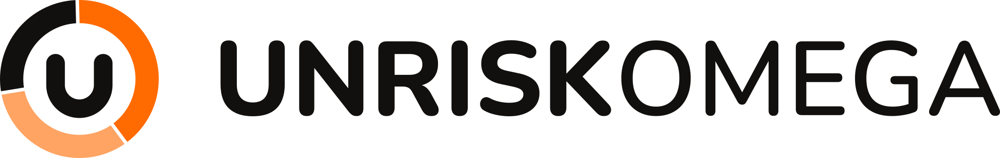

<picture>
  <source media="(prefers-color-scheme: dark)" srcset="assets/logos/uro-dark.svg">
  
</picture>

  

<picture>
  <source media="(prefers-color-scheme: dark)" srcset="assets/logos/partners-dark.png">
  
</picture>

# START Global x Swiss AI Weeks 2026: UNRISKOMEGA Challenge

Case materials for UNRISKOMEGA's Swiss {ai} Weeks 2026 hackathon challenge: wealth advisory portfolio data, reference UI screenshots, and client reporting documents.

## Contents

| | |
| --- | --- |
| [core-case/portfolio-data/](core-case/portfolio-data/) | The main dataset: 47 client/portfolio bundles plus shared lookup data. |
| [core-case/portfolio-data/DATA.md](core-case/portfolio-data/DATA.md) | Full data reference: every field, every join key, and the gotchas worth knowing. |
| [core-case/GUI-screenshots/](core-case/GUI-screenshots/) | Reference screenshots of the current advisory UI (client, advisor, and portfolio dashboards). |
| [side-challenge/](side-challenge/) | Ten quarterly client reports (Q4 2025) as PDFs, for the side challenge. |

## The data, in short

| File | Shape | Contains |
| --- | --- | --- |
| `clients.json` | Array of 47 **Client** objects | Identity, portfolios, holdings, proposals, transactions, suitability violations, tags, notes. |
| `reference.json` | One object, ~10 named collections | Security master data, fund breakdowns, suitability rules, risk/ESG profiles, advisory config, target allocations. |

Both files are plain, self-contained JSON: no application code or database is needed to read them. `clients.json` is the fact data, `reference.json` the lookup data, and IDs on the client side resolve into `reference.json` collections.

Three further client-data files in the same shape as `clients.json` will be handed over later for the live use case presentation, so build your solution to accept new files of this shape (for example via an upload) rather than hardcoding the one you have today.

## Before you start

A few conventions that will bite you if you miss them. The full list lives in [DATA.md](core-case/portfolio-data/DATA.md).

- **Absent, not null.** A field that has no value is simply missing from the object, and an entire `reference.json` collection can be missing too. Code defensively.
- **Join on `SecurityId`, not `Isin`.** The same ISIN can appear as several `Securities` rows, one per currency share class.
- **Mind the units.** Percentages in positions and SAA targets are fractions between 0 and 1, but `FundUnbundlingMappings[].Weight` is in percentage points from 0 to 100.
- **Use the `SAA_*` fields** when comparing holdings against target allocations. The plain classification fields use a finer taxonomy that will not match target category names.
- **Dates are shifted forward** by a constant offset so they read as current. Relative ordering and spacing are preserved; absolute dates are not meaningful.
- **Account `Currency` is not always an ISO code.** A few accounts hold crypto and reuse the cash account shape with a ticker such as `BTC` or `ETH`.

## Assets

Brand logos live in [assets/logos/](assets/logos/). Each mark ships in two variants: `*-light` for light backgrounds and `*-dark` for dark backgrounds.
